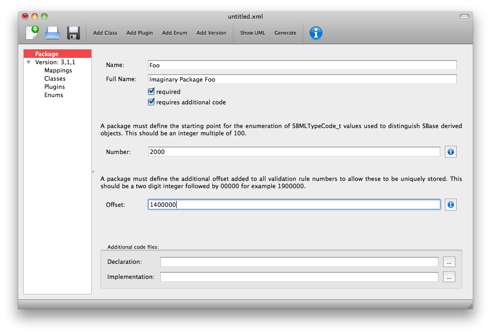

Defining an SBML Level 3 Package
================================

SBML Level 3 is the most recent specification of SBML. It is a modular
language, with a core comprising a complete format that stands alone .
Level 3 packages may be added to this core to provide additional,
optional features. Deviser provides a way of defining the package that
can then be used by generation code to create code for libSBML and text
for specifications.

It is necessary to define the structure of the SBML Level 3 package
before invoking other functionality available within Deviser. A series
of sheets guide you through the process in what we hope is an intuitive
manner. For the purpose of this manual we will work step by step through
creating an imaginary package ‘Foo’. Note the completed file is
available as part of the Deviser code in the ‘samples’ folder and can be
opened using the Deviser Edit tool.

Define the general package information
--------------------------------------

Start the Deviser Edit tool and select ‘Package’ from the tree on the
left hand side.

.. image:: ../screenshots/deviser-package.png

Figure 2 The ‘Package’ sheet - Illustrating the first step in defining
the ‘foo’ package.

The **Name** field is the short name that will be used as a prefix for
the package e.g. ‘foo’.

The **Full Name** field is the name that will be used to refer to the
package in documentation e.g. ‘Imaginary Package Foo’.

The **required** checkbox is used to indicate whether the package may
change the mathematical interpretation of the core model and corresponds
to the required attribute on the <sbml> element declaring this package
(see SBML snippet 1).

SBML snippet : The <sbml> element declaring use of the package 'foo'

The **Number** field is the starting point for the enumeration of the
typecodes for this package. Pressing the information button will pop-up
with information regarding the Number and Offset values used by existing
L3 packages (Figure 3).

The **Offset** field is the number added to the validation rules given
in the specification to allow this to be identified uniquely in code.
Pressing the information button will pop-up with information regarding
the Number and Offset values used by existing L3 packages.

.. image:: ../screenshots/deviser-numbers-offsets-1.png

Figure : The Numbers and Offsets information box

The **requires additional code** checkbox can be used to indicate that
there is additional code that will be required by the package that will
not be generated by Deviser. Checking the ‘requires additional code’ box
reveals further boxes that can be used to specify the location of the
additional code files. Deviser will incorporate this code ‘as-is’.

Figure 4 The ‘requires additional code’ check box.

Note this facility allows a user to include code for classes that are
not defined in Deviser and perhaps do not follow the usual libSBML
conventions for classes. When generating the code Deviser will merely
copy files listed here into the sbml directory for the package.

Add the version number
----------------------

Highlight ‘Version’ in the tree on the left hand side.

Fill in the core level and version and the package version numbers.

.. image:: ../screenshots/deviser-version.png

Figure 5 The ‘Version’ sheet

Note once classes have been specified they will be listed on this sheet
(see Figure 26) and the order in which they are listed can be changed.
This order dictates the order in which the generation code processes the
classes. This can be useful in ensuring documentation is written out in
a specific order.

The tree in the left hand panel shows the aspects of the package that
can now be added i.e. Classes, Plugins and Enums. The Mappings sheet
will be automatically populated when the description is complete. We
shall work through the different aspects.

Add class information
---------------------

This section describes how to specify a class. The first subsection
gives a brief overview of what is meant by a ‘class’. The next two
subsections give an overview of the information that needs to be
provided and then we work through several examples.

An SBML ‘element’ or ‘class’
~~~~~~~~~~~~~~~~~~~~~~~~~~~~

In SBML XML elements are used to capture the information relating to
particular objects by means of attributes to specify characteristics of
the element and where necessary child elements to provide further
information. SBML generally uses an enclosing listOf element to group
elements of the same type together. The names of attributes and elements
are chosen to be intuitive and libSBML mimics these names and structure
in its class definitions and API. This is illustrated in the figures
below. We use class to mean the description of an XML element. In
object-oriented programming languages (such as C++ or Java), this is
represented as a class.

Figure 6 shows a snapshot of libSBML class hierarchy corresponding to
SBML snippet 2. Note the correspondence of names and the getXYZ
functions etc.

.. image:: ../figures/deviser-libsbml-class.png

Figure Snapshot of part of libSBML class hierarchy

General class description
~~~~~~~~~~~~~~~~~~~~~~~~~

We use class to mean the description of an XML element. You will need to
specify the details for every new XML element that the package defines
including classes that are abstract and/or used as base classes for
other classes. You may find yourself repeating information but this is
necessary to facilitate creating a valid definition that the
auto-generation code can work with (see section 2.3.4).

Select ‘Add Class’ from the toolbar or the ‘Edit’ menu.

.. image:: ../screenshots/deviser-add-class.png

Figure 7 The ‘Class’ sheet

NOTE: Using the ‘wand’ button will populate the adjacent field with the
value of the field that conforms most closely to SBML and libSBML
conventions.

The **Name** field is the name of the class that will be used by the
code generation (see XML ElementName below). This field is required and
must be populated.

The **BaseClass** field gives a base class if this class derives from a
base. Clicking the wand will populate the field with ‘SBase’, as this is
the most common base class for libSBML classes. Note this field is a
required field and leaving it blank implies that there is no base class
for the class being specified.

The **TypeCode** field is a value that will be used in an enumeration of
the types for this package. Clicking on the wand populates it with
SBML\_PACKAGE\_CLASS where PACKAGE is the short package name given and
CLASS is the name field for this class. This field is also required and
cannot be left blank. You must populate it.

The **XML ElementName** is an optional field that can be used to specify
the name of the element as it will appear in the XML output. This
defaults to the class name with a lowercase first letter. An example of
where this might be different from the default is if two packages use
the same class name and it is necessary to distinguish between these in
code. The example in Figure 11 shows a case where we have reused the
class ‘KineticLaw’ within our package foo and indicate that code should
generate a class named FooKineticLaw but that text and the XML output
should use ‘kineticLaw’ as the name of the element.

The **hasListOf** checkbox is used to indicate whether the element has a
parent ListOf class. In SBML it is common for elements ‘bar’ to occur
within a list of element ‘listOfBars’. However some elements may occur
without a containing ListOf. If this checkbox is selected code will also
be generated for a ListOfXYZ class corresponding to the class being
described.

The **isBaseClass** checkbox is used to indicate that the class being
defined is in fact a base class for other classes within the
specification.

The **requires additional code** checkbox can be used to indicate that
there is additional code that will be required by the package that will
not be generated by Deviser. Checking the ‘requires additional code’ box
reveals further boxes that can be used to specify the location of the
additional code files. Deviser will incorporate this code ‘as-is’. Given
here the additional code would expect to be part included within the
class being generated. A case where this is useful is where the class
may take data that might be compressed and the additional code files can
be used to provide the functions to compress and decompress the data.

The **Class attributes and child elements** table is used to specify
each attribute and child element for the class. These are added and
deleted using the ‘+’ and ‘-‘ buttons to the left of this table.

Adding attributes and child elements
~~~~~~~~~~~~~~~~~~~~~~~~~~~~~~~~~~~~

Here we expand on the fields in the **Class attributes and child
elements** table for a class as shown in Figure 7.

The **Name** field gives the name of the attribute or child element. In
the rare cases where this Name is not an exact match with the name that
will appear in the XML the ‘XML name’ field can be used to override.

The **Type** field gives the type of the attribute or child.

Note the type used here allows the underlying Deviser auto-generation
code to determine which data type should be used in code to represent
the particular attribute. Deviser Edit does not restrict what can be
used here – as users may be using types that Deviser has not
anticipated. If the auto-generation code encounters a type with which it
is unfamiliar it will add code assuming the object to be an attribute
(not element) but use ‘FIX ME’ as the type declaration

The recognized types for an attribute are the datatypes allowed by SBML.
These are (with accepted variations):

    string, bool(ean), double, int(eger), unsigned int(eger), positive
    int(eger),

    non-negative int(eger), ID, SId, SIdRef, UnitSId, UnitSIdRef

and additionally Deviser Edit will accept and process:

array, enum, element, lo\_element, inline\_lo\_element.

\Appendix B gives the lists the types with their corresponding
C++ data type. The additional types accepted by Deviser are explained in
detail in the sections below (Sections 2.3.3.1 - 2.3.3.4 ).

It should be noted that the ‘Type’ used for each attribute/child element
determines the functions that will be produced (see Code example 1).

Attribute/child element type ‘array’
^^^^^^^^^^^^^^^^^^^^^^^^^^^^^^^^^^^^

The ‘array’ type refers to an XML element that may contain text that
represents a list of numerical values of a particular type. For example
the L3 Spatial Package uses a SampledField element that contains an
‘array’ of integers (see SBML snippet 3).

This information would be defined in the ‘Class attributes and child
elements’ section of the Class description as an entry with

Name: the name to be used by code to store and manipulate this
information

Type: array

Element: integer (the numeric type of the data)

and the corresponding functions are produced.

Attribute/child element type ‘enum’
^^^^^^^^^^^^^^^^^^^^^^^^^^^^^^^^^^^

If the attribute is of an enumeration type defined within the package it
should have type ‘enum’ and the Element field should give the name of
the enumeration. The enumeration is declared fully by adding an
enumeration to the description (see Add enum information).

.. image:: ../screenshots/deviser-array-enum.png

Figure : Attributes of type 'array' and 'enum'

Attribute/child element types ‘element’ and ‘lo\_element’
^^^^^^^^^^^^^^^^^^^^^^^^^^^^^^^^^^^^^^^^^^^^^^^^^^^^^^^^^

Here the child refers to a single instance of another class. If that
class is a ListOfClass ‘lo\_element’ should be used. The name of the
child element is given in the Element field; where the container is a
listOf the Element field should be the child of the listOf. Table 1
gives examples of the expected XML and the functions produced for each
type.

Attribute/child element type ‘inline\_lo\_element’
^^^^^^^^^^^^^^^^^^^^^^^^^^^^^^^^^^^^^^^^^^^^^^^^^^

On occasion an element may contain multiple children of the same type
which are not specified as being within a listOf element. From a code
point of view it is easier to consider these children as being within a
listOf element as this provides functionality to access and manipulate
potentially variable numbers of child elements. The
‘inline\_lo\_element’ type allows the user to specify that there are
multiple instances of the same child element but that these do not occur
within a specified ListOf element. Table 1 gives examples of the
expected XML and the functions produced.

+---------------------------+------------------------------+----------------------------------------+
| **Type**                  | **XML output**               | **Functions**                          |
+===========================+==============================+========================================+
| **element**               | <container>                  | getParameter()                         |
|                           |                              |                                        |
|                           | <parameter attributes= …/>   | isSetParameter()                       |
|                           |                              |                                        |
|                           | </container>                 | setParameter(Parameter\*)              |
|                           |                              |                                        |
|                           |                              | unsetParameter()                       |
|                           |                              |                                        |
|                           |                              | createParameter()                      |
+---------------------------+------------------------------+----------------------------------------+
| **lo\_element**           | <container>                  | getListOfParameters()                  |
|                           |                              |                                        |
|                           | <listOfParameters>           | getParameter(index) getParameter(id)   |
|                           |                              |                                        |
|                           | <parameter attributes= …/>   | addParameter(Parameter\*)              |
|                           |                              |                                        |
|                           | <parameter attributes= …/>   | getNumParameters()                     |
|                           |                              |                                        |
|                           | …                            | createParameter()                      |
|                           |                              |                                        |
|                           | </listOfParameters>          | removeParameter(index)                 |
|                           |                              |                                        |
|                           | </container>                 | removeParameter(id)                    |
+---------------------------+------------------------------+----------------------------------------+
| **inline\_lo\_element**   | <container>                  | getListOfParameters()                  |
|                           |                              |                                        |
|                           | <parameter attributes= …/>   | getParameter(index) getParameter(id)   |
|                           |                              |                                        |
|                           | <parameter attributes= …/>   | addParameter(Parameter\*)              |
|                           |                              |                                        |
|                           | …                            | getNumParameters()                     |
|                           |                              |                                        |
|                           | </container>                 | createParameter()                      |
|                           |                              |                                        |
|                           |                              | removeParameter(index)                 |
|                           |                              |                                        |
|                           |                              | removeParameter(id)                    |
+---------------------------+------------------------------+----------------------------------------+

Table : The 'element', 'lo\_element' and 'inline\_lo\_element' types

The **Element** field provides additional information depending on the
type of the object being described. Table 2 describes how this field
should be populated. Note the ‘name’ of an element or object refers to
the ClassName of the appropriate object.

+-----------------------+---------------------------------------------------+
| **Type**              | **Element field**                                 |
+=======================+===================================================+
| array                 | type of data within the array                     |
+-----------------------+---------------------------------------------------+
| enum                  | The name of the enumeration                       |
+-----------------------+---------------------------------------------------+
| element               | The class name of the element                     |
+-----------------------+---------------------------------------------------+
| lo\_element           | The class name of the element within the ListOf   |
+-----------------------+---------------------------------------------------+
| inline\_lo\_element   | The class name of the element                     |
+-----------------------+---------------------------------------------------+
| SIdRef                | The class name of the object being referenced.    |
|                       |                                                   |
|                       | (Limited to one element for now). [1]_            |
+-----------------------+---------------------------------------------------+
| Any other             | blank                                             |
+-----------------------+---------------------------------------------------+

Table : Expected values for the Element field based on attribute Type

The **Required** field indicates whether the attribute or child element
is mandatory. On occasion SBML has conditional requirements e.g. you
must set either StoichiometryMath or stoichiometry but you cannot have
both. As yet Deviser does not deal with this situation. We recommend
that if you need to facilitate this situation you mark both attributes
as ‘unrequired’ and adjust the generated code accordingly.

The **isBaseClass** field indicates that the child element is a base
class and not instantiated directly. This is a situation that will not
commonly occur but happens when there is multiple nesting of classes.
The current ‘spatial’ package defines a CSGTransformation that inherits
from CSGNode but also contains an element of that type (see Figure 9 and
Figure 10).

.. image:: ../figures/CSGTransformation-uml.png

Figure : UML diagram of CSGTransformation from SBML L3 'spatial' package
specification

.. image:: ../screenshots/deviser-csgtransformation.png

Figure : DeviserEdit description of CSGTransformation

Note that the child element ‘csgNode’ has been marked as a base class.
This tells Deviser to generate code relevant to the instantiations of
the CSGNode class rather than for a concrete CSGNode child. For example,
instead of getting a ‘createCSGNode()’ function, you would get create
functions for all the instantiations of the base class:
createCSGTransformation(); createCSGPrimitive();
createCSGPseudoPrimitive() and createCSGSetOperator() corresponding to
CSGTransformation, CSGPrimitive, CSGPseudoPrimitive and CSGSetOperator
that are the direct instantiations of the CSGNode class.

The **XML name** field can be used to specify the name of the element as
it will appear in the XML output where this may differ from the Name
field. For attributes it is unlikely that the Name used will differ from
the XML name; however if the object being listed is an element or listOf
element there may be situations where they differ – as in Example 2
below.

A note on repeated information
~~~~~~~~~~~~~~~~~~~~~~~~~~~~~~

Users may become aware of the fact that at times they are entering
duplicate information. For example if a child element is used that does
not have the default XML Name then this will be declared both when
describing the Class for that element AND when listing the child element
occurrence (see Example 2). Also, classes derived from a base class are
listed as Instantiations of that class when it would be possible to work
out this information from the BaseClass information given for each
class.

Deviser Edit **does require this information to be duplicated** as this
facilitates the storing of unfinished definitions and allows the
definition to be validated to an extent. It also means that each sheet
contains all the pertinent information for the Class being specified
rather than this information being distributed across various sheets in
the GUI.

Example 1 - Adding a class with no containing ListOf
~~~~~~~~~~~~~~~~~~~~~~~~~~~~~~~~~~~~~~~~~~~~~~~~~~~~

Here we define the KineticLaw class for our imaginary package ‘foo’.

.. image:: ../screenshots/deviser-foo-kl.png

Figure 11 Defining the FooKineticLaw class.

We know that libSBML already contains a class KineticLaw and so we use a
class name that reflects the package and class i.e. ‘FooKineticLaw’ and
we specify that the XML ElementName will be ‘kineticLaw’. Thus the
generated code will use a class ‘FooKineticLaw’ that will not conflict
with existing libSBML classes but would output this in XML as an element
<foo:kineticLaw>. This causes no conflict as XML Namespaces keep
elements completely separate.

Our class has three attributes/child elements.

The first is a boolean attribute called ‘stochastic’, which is
mandatory. So we add the name ‘stochastic, the type ‘boolean’ and change
the required status to ‘true’.

The second child is a ListOfParameters. Again we know that name will
conflict with the class ListOfParameters so we add the name
‘listOfFooParameters’, the type ‘lo\_element’, the element
‘FooParameter’ and state that the XML name is ‘listOfParameters’. Note
that we will need to specify the class FooParameter later on; which we
do in Example 2.

The third child is a math element. So we add the name ‘math’, the type
‘element’ and the element ‘ASTNode\*’. Note that Deviser does
specifically recognize the elements ASTNode and XMLNode and treats them
appropriately as elements that will contain either MathML or XML content
respectively. Other elements listed are assumed to be parsed as elements
belonging to libSBML; either those defined by this package or ones
defined in core or other available package code.

Example 2 - Adding a class with a containing ListOf
~~~~~~~~~~~~~~~~~~~~~~~~~~~~~~~~~~~~~~~~~~~~~~~~~~~

Here we specify the FooParameter class used by the FooKineticLaw that we
specified in Example 1.

.. image:: ../screenshots/deviser-foo-param.png

Figure 12 Defining the FooParameter class.

The **hasListOf** checkbox has been selected and a number of additional
fields appear.

The **ListOfClassName** is the name used in code for the class
representing the ListOf object. Again it need only be populated if the
default of ‘ListOfBars’ is inappropriate.

The **XML ListOfName** field is the XML name for the list of objects. It
only needs to be populated if there is a difference in name between XML
and code. It will default to ‘listOfBars’ where ‘Bar’ is the class name.

In our example we have populated these fields as we have used a class
name ‘FooParameter’ but will have XML names of ‘parameter’ and
‘listOfParameters’.

The **Minimum number of children** field is used to indicate the minimum
number of child objects of type Bar a ListOfBars expects. Currently in
SBML ListOf elements cannot be empty and so must have a minimum of 1
child; which we have indicated in our example. Leaving this blank
implies there is no stated minimum value for the number of children.

The **Maximum number of children** field is used to indicate the maximum
number of child objects a ListOf expects. Leaving this blank implies
there is no stated maximum value for the number of children.

The **ListOf attributes** table (which has the same fields as the table
for entering class attributes and child elements) allows you to add
attributes to the ListOf class.

Figure 13 shows the UML diagram produced by Deviser Edit of the package
‘foo’ as described so far in examples 1 and 2 while the corresponding
SBML is shown in SBML snippet 4.

.. image:: ../figures/deviser-uml-foo-kl.png

Figure : The UML diagram produced by Deviser Edit following the
definition of package 'Foo' in

Examples 1 and 2

Example 3 – Adding a base class and derived classes
~~~~~~~~~~~~~~~~~~~~~~~~~~~~~~~~~~~~~~~~~~~~~~~~~~~

Here we define a class that will be used as a base class for others (see
Figure 14).

.. image:: ../screenshots/deviser-foo-rule.png

Figure 14 Defining the base class ‘FooRule’.

This class is named FooRule and has a corresponding ListOf element. Note
we have not filled in any alternative names so we will expect to get an
element called listOfFooRules in the XML.

This class is a base class and we tick the isBaseClass checkbox. The
**Instantiations** table then appears.

The **Instantiations** table allows you to specify the class(es) that
will be derived from this base class. Note Deviser Edit expects these to
be listed here – even if the information could be determined elsewhere.
Entries in this table do not define a class, the definition of the class
should be created as a separate class entry. Only classes that directly
inherit from this class need be listed; it may be that the classes
listed are themselves base classes for further classes. These should be
listed as the Instantiations on the relevant base class description.

Instantiations fields
^^^^^^^^^^^^^^^^^^^^^

The **XML name** field specifies the XML name of the object.

The **Element** field specifies a class that will be derived from this
FooRule base class.

The **Min No. Children** field is used to specify a minimum number of
children that this element may have.

The **Max No. Children** field is used to specify the maximum number of
children.

Note that sometimes a specific instantiation adds further requirements.
For example, where one class may contain children of the same base class
there may be a requirement that it contains a certain number of children
as with Associations in the FBC package an FBCAnd instantiation MUST
have two children. Where there are no such requirements these fields
should be left as ‘0’.

Here we have specified that the ListOfFooRules may contain objects of
type Assignment or Algebraic. We specify Algebraic as a new class as in
Figure 15 and Assignment in Figure 16.

.. image:: ../screenshots/deviser-foo-algebraic.png

Figure 15 Defining the Algebraic class

Note that we have changed the BaseClass field to FooRule.

.. image:: ../screenshots/deviser-foo-assignment.png

Figure : Defining the Assignment class.

The Assignment class illustrates a slightly more complex scenario. Here
it derives from the baseClass FooRule and adds an attribute ‘variable’
that is a reference to a FooParameter. It have also acts as a base class
for two further classes FooRate and FooAssignment. Figure 17 shows the
hierarchy and SBML snippet 5 the resulting XML.

.. image:: ../figures/deviser-uml-foo-rules.png

Figure : The UML diagram from DeviserEdit of the ListOfFooRules class

1. .. rubric:: Add plugin information
      :name: add-plugin-information

   1. .. rubric:: What is a plugin ?
         :name: what-is-a-plugin

In order to extend SBML Level 3 Core with a package not only is it
necessary to define new classes, it is also necessary to attach these
elements to an existing point in an SBML model. The simplest case would
be that a new element is added to the containing <sbml> element but the
point of extension may be much further embedded within the SBML. Here
(and indeed within libSBML) we use the term ‘plugin’ to specify the
necessary information that links the new package classes with other
classes. Code for any given class in any relevant function then checks
whether it has a plugin attached and passes control to the plugin if
necessary. Figure 18 shows two plugins on the Model class, one by the
‘qual’ package and the other by the ‘fbc’ package. Note the names
reflect the package and the object being extended.

.. image:: ../figures/deviser-libsbml-plugin.png

Figure libSBML class hierarchy showing ‘plugins’ to the Model class

General plugin information
~~~~~~~~~~~~~~~~~~~~~~~~~~

Plugin information describes the elements that are extended by the new
classes defined within a package. The elements to be extended may come
from SBML Level 3 Core or another SBML Level 3 package.

Select ‘Add Plugin’ from the toolbar or the ‘Edit’ menu.

.. image:: ../screenshots/deviser-add-plugin.png

Figure 19 The ‘Plugin’ sheet.

The **ExtensionPoint** field is used to specify the name of the element
that is being extended. This will be the name of the class as used by
libSBML.

The **element from core** checkbox is used to specify whether the object
being extended originates in SBML Core or another Level 3 package.

The **hasAttributes** checkbox should be ticked if the package is going
to extend an object with attributes rather than (or as well as)
elements.

As on other sheets the **requires additional code** checkbox can be used
to indicate that there is additional code that will be required by the
package that will not be generated by Deviser. Checking the ‘requires
additional code’ box reveals further boxes that can be used to specify
the location of the additional code files. Deviser will incorporate this
code ‘as-is’.

The sheet for adding a plugin lists the classes that have already been
specified (**Defined Classes**) and are ‘available’ to extend an object.
These can be selected and moved into the **Child Classes** column.

Example 4 – Extending a core element
~~~~~~~~~~~~~~~~~~~~~~~~~~~~~~~~~~~~

Here we are going to specify that the ‘foo’ package extends the SBML
Level 3 Core Reaction with the new FooKineticLaw class.

.. image:: ../screenshots/deviser-plugin-react.png

Figure 20 Defining the extension of SBML Level 3 Core Reaction by
package foo.

We fill in the **ExtensionPoint** with ‘Reaction’, tick the checkbox to
note that the element is from core. Highlight FooKineticLaw in the
**Defined Classes** column and use the arrows to move it to the **Child
Classes** column. Essentially this is telling Deviser to generate the
class FooReactionPlugin which will expect to have a data member of type
FooKineticLaw class.

Example 5 – Extending a core element with attributes only
~~~~~~~~~~~~~~~~~~~~~~~~~~~~~~~~~~~~~~~~~~~~~~~~~~~~~~~~~

Here we declare that the **ExtensionPoint** is Model from core and tick
the **hasAttributes** checkbox.

The table **Child attributes and child elements** appears. This is used
for adding attributes and child elements as previously described. Here
we specify that the Model will have a required boolean attribute
‘useFoo’ from the foo package (Figure 21). Note that it is not necessary
to specify child elements that originate in the package being defined
i.e. those that have already been listed as **Child classes**.

.. image:: ../screenshots/deviser-plugin-model.png

Figure 21 Defining the extension of SBML Level 3 Core Model by package
foo.

Example 6 – Extending a non-core element
~~~~~~~~~~~~~~~~~~~~~~~~~~~~~~~~~~~~~~~~

Here we declare that the **ExtensionPoint** is Transition from the
Qualitative Models (qual) Package. The package foo adds the
ListOfFooRules object to the Transition object.

.. image:: ../screenshots/deviser-plugin-trans.png

Figure 22 Defining the extension of SBML Level 3 Qual Transition by
package foo.

Add enum information
--------------------

SBML allows users to define data types as enumerations of allowed
values. Here we describe how to specify these.

Example 7 – Adding an enumeration
~~~~~~~~~~~~~~~~~~~~~~~~~~~~~~~~~

Assume we have an object ‘extra’ that has an attribute called ‘sign’
which is of an enumeration type ‘Sign’. Firstly we define the class
‘Extra’ and specify the attribute. In this case the **Type** of the
attribute is ‘enum’ and the **Element** field gives the name of the
enumeration type ‘Sign’ as shown in Figure 23.

.. image:: ../screenshots/deviser-foo-extra.png

Figure 23 Defining the Extra class which has an attribute of type enum.

Then it is necessary to specify the enumeration itself. Use the **Add
Enum** button from the toolbar or Edit menu.

The **Name** field is used to declare the name of the enumeration, in
this case Sign. Note that when generating code Deviser will append an
‘\_t’ to this name.

The table is used to specify the individual allowed values of the
enumeration.

The **Name** field is the enumeration value that will appear in the
enumeration itself.

The **Value** field gives the corresponding string value of that member
of the enumeration.

Here (Figure 24) we have specified that the enumeration sign has three
possible values: ‘positive’, ‘negative’ and ‘neutral. Note the names
used reflect the individual values and the package in which they
originate. It is not necessary to add a default or “unknown” value –
Deviser will do this when generating code.

.. image:: ../screenshots/deviser-enum-sign.png

Figure 24 Defining the Sign enumeration.

Mappings
--------

Once the class and plugin descriptions are complete the Deviser Edit
tool will determine if there are any classes present that do not
originate from core or the package being described. Select ‘Mappings’
from the tree in the panel on the left hand side. The tool will have
prepopulated this with any relevant classes and all that remains is for
the package information to be filled in.

.. image:: ../screenshots/deviser-foo-mappings.png

Figure Identifying the origin of classes from other packages

The **Package** field is used to add the name of the package in which
the class given in the **Name** field originates. In our example we have
used the Transition and QualitativeSpecies classes both of which
originate in the ‘qual’ package, so this information is added. Note on
this sheet only the **Package** column can be edited. The **Name**
column is populated by the tool.

Results
-------

Select ‘Version’ from the tree in the panel on the left hand side. Now
that all the classes have been defined these are listed here (see Figure
26) and the ordering can be adjusted. The order will dictate the order
of the relevant section in the TeX documents.

.. image:: ../screenshots/deviser-full-decsr.png

Figure 26 The complete description of the foo package

The Deviser Edit tool creates an XML description from the definition
that is used by other code to generate UML, TeX and libSBML code.

Note this underlying XML file can be saved at any point and reopened
using Deviser Edit or with any XML Editor. The full description of the
Imaginary Foo Package used in the Examples can be seen in Appendix A or
is available in the deviser/samples directory.

Validating the description
~~~~~~~~~~~~~~~~~~~~~~~~~~

NOTE TO LUCIAN: We have not yet finished implementing all the
validation. The plan is to provide a list here of all the possible
errors and warnings that might be reported.

There are two further options on the Edit menu that have not yet been
discussed.

**Validate Description** runs a series of internal checks on the
information provided and prompts the user to fill in any required
fields.

A pop-up window (Figure 27) will appear with either an error message or
a confirmation that everything is consistent. The Copy button can be
used to copy the contents of the report to the clipboard and thus makes
them available for pasting elsewhere.

.. image:: ../screenshots/deviser-validation.png

Figure Validating the package description

**Fix Errors** provides a direct way of validating and then correcting
any inconsistencies. It is advisable to use **Validate Description**
following **Fix Errors** as some errors cannot be automatically fixed.

