Defining an SBML Level 3 Package
================================

SBML Level 3 is the most recent specification of SBML. It is a modular
language, with a core comprising a complete format that stands alone .
Level 3 packages may be added to this core to provide additional,
optional features. Deviser provides a way of defining the package that
can then be used by generation code to create code for libSBML and text
for specifications.

It is necessary to define the structure of the SBML Level 3 package
before invoking other functionality available within Deviser. A series
of sheets guide you through the process in what we hope is an intuitive
manner. For the purpose of this manual we will work step by step through
creating an imaginary package ‘Foo’. Note the completed file is
available as part of the Deviser code in the ‘samples’ folder and can be
opened using the Deviser Edit tool.

Define the general package information
--------------------------------------

Start the Deviser Edit tool and select ‘Package’ from the tree on the
left hand side.

.. _fig-begin:
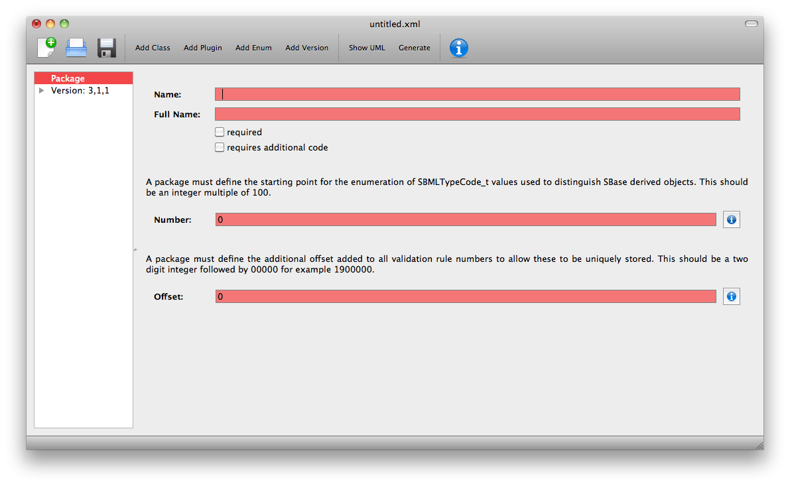

   The ‘Package’ sheet with no information.

Fields colored red are mandatory and will remain red until a valid value has 
been entered.

.. _fig-package:
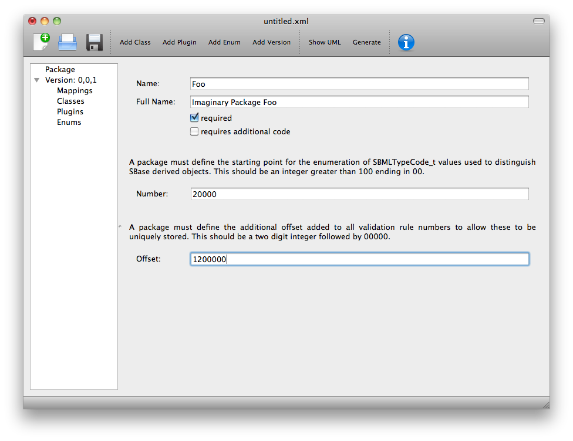

   The ‘Package’ sheet - Illustrating the first step in defining the ‘foo’ 
   package.

.. _pkg-name:

The Package **Name** field
~~~~~~~~~~~~~~~~~~~~~~~~~~

The **Name** field is the short name that will be used as a prefix for
the package e.g. ‘foo’. This is a required field.

.. _pkg-fullname:

The Package **Full Name** field
~~~~~~~~~~~~~~~~~~~~~~~~~~~~~~~~~

The **Full Name** field is the name that will be used to refer to the
package in documentation e.g. ‘Imaginary Package Foo’. This is a required field.

The Package **required** checkbox
~~~~~~~~~~~~~~~~~~~~~~~~~~~~~~~~~~

The **required** checkbox is used to indicate whether the package may
change the mathematical interpretation of the core model and corresponds
to the required attribute on the <sbml> element declaring this package
(see below).

.. code-block:: XML
  
   <sbml xmlns=http://www.sbml.org/sbml/level3/version1/core
         xmlns:foo=http://www.sbml.org/sbml/level3/version1/foo/version1
         level="3" version="1" foo:required="true">

.. _pkg-number:

The Package **Number** field
~~~~~~~~~~~~~~~~~~~~~~~~~~~~~

The **Number** field is the starting point for the enumeration of the
typecodes for this package. This is a required field. 

Pressing the information button will pop-up
with information regarding the Number and Offset values used by existing
L3 packages (Figure :num:`fig-offsets`). 

.. _pkg-offset:

The Package **Offset** field
~~~~~~~~~~~~~~~~~~~~~~~~~~~~~

The **Offset** field is the number added to the validation rules given
in the specification to allow this to be identified uniquely in code.
This is a required field.

Pressing the information button will pop-up with information regarding
the Number and Offset values used by existing L3 packages 
(Figure :num:`fig-offsets`).

.. _fig-offsets:
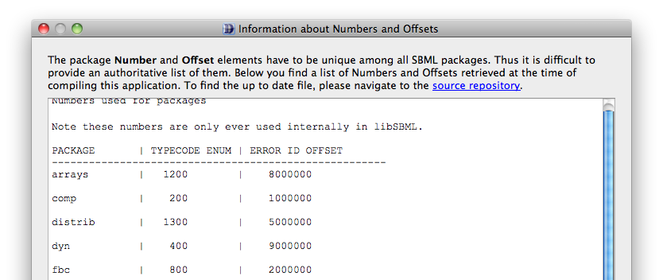

    The Numbers and Offsets information box

The Package **requires additional code** checkbox
~~~~~~~~~~~~~~~~~~~~~~~~~~~~~~~~~~~~~~~~~~~~~~~~~~~

.. todo::
   This sub-section needs work

.. 
    COMMENTED OUT
    The **requires additional code** checkbox can be used to indicate that
    there is additional code that will be required by the package that will
    not be generated by Deviser. Checking the ‘requires additional code’ box
    reveals further boxes that can be used to specify the location of the
    additional code files. Deviser will incorporate this code ‘as-is’.
    
    .. _fig-add-code:
    .. figure:: ../screenshots/deviser-add-code.png
    
       The ‘requires additional code’ check box.
    
    Note this facility allows a user to include code for classes that are
    not defined in Deviser and perhaps do not follow the usual libSBML
    conventions for classes. When generating the code Deviser will merely
    copy files listed here into the sbml directory for the package.
    
    .. todo::
      Check above statement is correct

.. raw:: latex

  \clearpage

Add the version number
----------------------

Highlight ‘Version’ in the tree on the left hand side.

Fill in the core level and version and the package version numbers. These
default to **Core level** '3' and **Core version** '1' as SBML L3V1 is the only official 
SBML Level 3 version at the time of writing. The package version (**Pkg Version**)
defaults to '1'. Using Deviser to specify more than one version of a package
is discussed in :ref:`mult-vers`.

.. _fig-version:
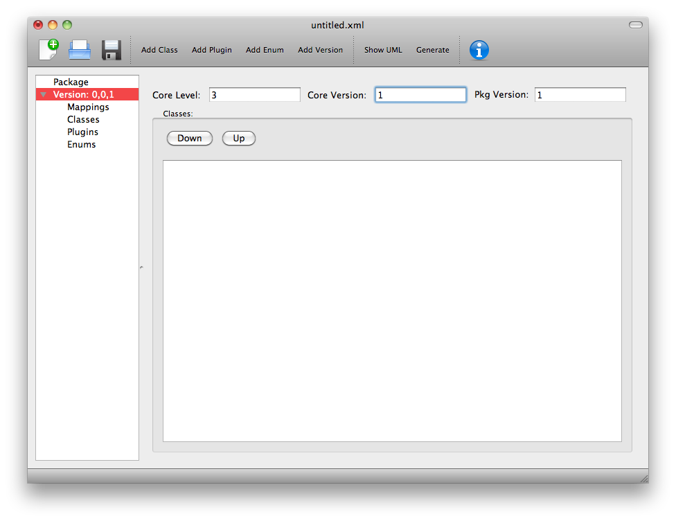

    The ‘Version’ sheet

Note once classes have been specified they will be listed on this sheet
(see Figure :num:`fig-full-decsr`) and the order in which they are listed 
can be changed.
This order dictates the order in which the generation code processes the
classes. This can be useful in ensuring documentation is written out in
a specific order.

The tree in the left hand panel shows the aspects of the package that
can now be added i.e. Classes, Plugins and Enums. The Mappings sheet
will be automatically populated when the description is complete. We
shall work through the different forms.

.. raw:: latex

  \clearpage

Add class information
---------------------

This section describes how to specify a class. The first subsection
gives a brief overview of what is meant by a ‘class’. The next two
subsections give an overview of the information that needs to be
provided and then we work through several examples.

What is a class ?
~~~~~~~~~~~~~~~~~~~~~~~~~~~~

In SBML XML elements are used to capture the information relating to
particular objects by means of attributes to specify characteristics of
the element and where necessary child elements to provide further
information. SBML generally uses an enclosing listOf element to group
elements of the same type together. The names of attributes and elements
are chosen to be intuitive and libSBML mimics these names and structure
in its class definitions and API. This is illustrated in the figures
below. Deviser Edit uses 'class' to mean the description of an XML element. In
object-oriented programming languages (such as C++ or Java), this is
represented as a class object.

.. _SBML-snippet-reaction:

   SBML snippet 1: A SBML Level 3 Core ListOfReactions element.

.. code-block:: XML

   <listOfReactions>
       <reaction id="reaction_1" reversible="false" fast="false">
           <listOfReactants>
               <speciesReference species="X0" constant="true"/>
           </listOfReactants>
           <listOfProducts>
               <speciesReference species="S1" constant="true"/>
           </listOfProducts>
           <kineticLaw>
               <math xmlns="http://www.w3.org/1998/Math/MathML">
                   <apply>
                       <times/>
                       <ci> K0 </ci>
                       <ci> X0 </ci>
                   </apply>
               </math>
           </kineticLaw>
       </reaction>
   </listOfReactions>

Figure :num:`fig-libsbml-class` shows a snapshot of libSBML class hierarchy 
corresponding to
:ref:`SBML snippet 1 above<SBML-snippet-reaction>`. Note the correspondence of names and the getXYZ
functions etc.

.. _fig-libsbml-class:
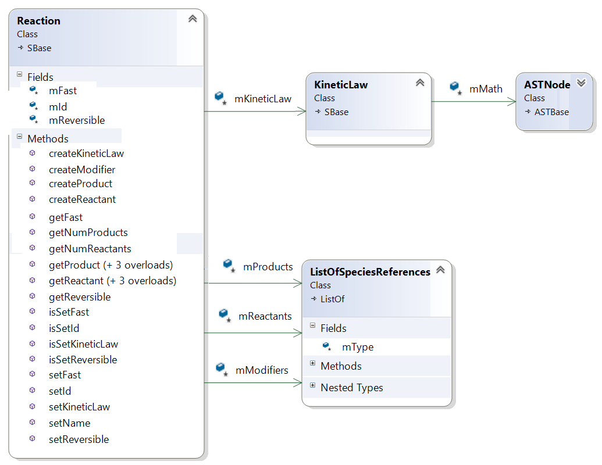

   Snapshot of part of libSBML class hierarchy. The 'Reaction' class has fields
   mFast, mId and mReversible which correspond to the attributes of the <reaction>
   element within the SBML. It has a child member of type 'KineticLaw' which 
   itself has a child member of type 'ASTNode'. These capture the information
   contained within the <kineticLaw> element and it's subelement <math>. The 
   list of Methods for the 'Reaction' class show the correspondance between the
   element/attribute names used in the SBML and the function names used by libSBML.

.. raw:: latex

  \clearpage

General class information
~~~~~~~~~~~~~~~~~~~~~~~~~

We use class to mean the description of an XML element. You will need to
specify the details for every new XML element that the package defines
including classes that are abstract and/or used as base classes for
other classes. You may find yourself repeating information but this is
necessary to facilitate creating a valid definition that the
auto-generation code can work with (see section `A note on repeated 
information`_ ).

Select ‘Add Class’ from the toolbar or the ‘Edit’ menu.

.. _fig-add-class:
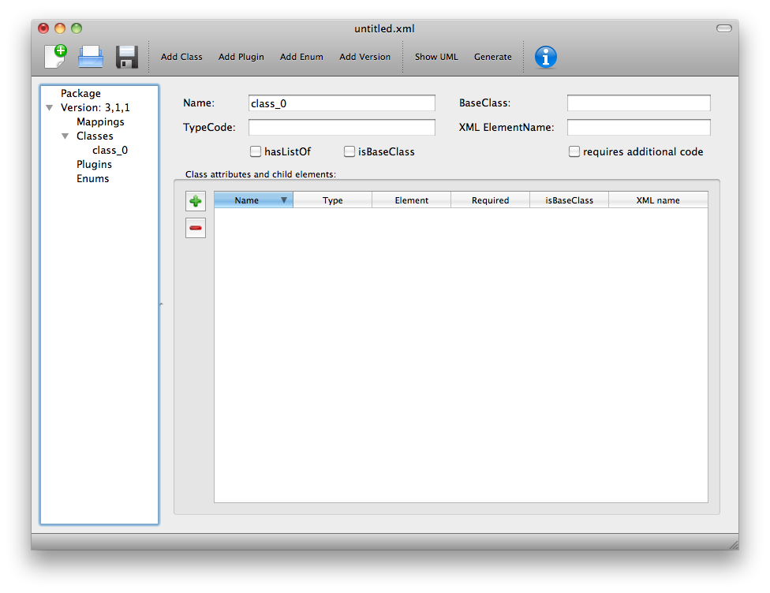

     The ‘Class’ sheet

NOTE: Using the ‘wand’ button will populate the adjacent field with the
value of the field that conforms most closely to SBML and libSBML
conventions.

Fields that are madatory will remain red until populated.

The Class **Name** field
*************************

The **Name** field is the name of the class that will be used by the
code generation (see XML ElementName below). This field is required and
must be populated.

The Class **BaseClass** field
******************************

The **BaseClass** field gives a base class if this class derives from a
base. Clicking the wand will populate the field with ‘SBase’, as this is
the most common base class for libSBML classes. Code generated using Deviser 
assumes that 
all classes ultimately derive from SBase as it uses the generic SBase
code for reading and writing to and from an XML document. Therefore, leaving 
the field empty 
implies that the base class is SBase.

.. _typecode:

The Class **TypeCode** checkbox and field
******************************************

The **TypeCode** is a value that will be used in an enumeration of
the types for this package.  This is used in code to distinguish between
SBase derived classes. Initially Deviser Edit displays a check box with
the caption **Use default type code**. Leaving this checked implies that it is 
acceptable for Deviser to use a default typecode of SBML\_PACKAGE\_CLASS 
where PACKAGE is the short 
package name given and
CLASS is the name field for this class. 

Unchecking the box will reveal a text box with the 'wand' icon. This field is 
mandatory. The user must enter a value. Note that using the 'wand' will populate the 
field with the default typecode
SBML\_PACKAGE\_CLASS as above. 

The Class **XML ElementName** field
************************************

The **XML ElementName** is an optional field that can be used to specify
the name of the element as it will appear in the XML output. This
defaults to the class name with a lowercase first letter. An example of
where this might be different from the default is if two packages use
the same class name and it is necessary to distinguish between these in
code. The example in Figure :num:`fig-foo-kl` shows a case where we have 
reused the
class ‘KineticLaw’ within our package 'foo' and indicate that code should
generate a class named FooKineticLaw but that text and the XML output
should use ‘kineticLaw’ as the name of the element.

.. _listofbox:

The Class **hasListOf** checkbox
*********************************

The **hasListOf** checkbox is used to indicate whether the element has a
parent ListOf class. In SBML it is common for elements ‘bar’ to occur
within a list of element ‘listOfBars’. However some elements may occur
without a containing ListOf. If this checkbox is selected code will also
be generated for a ListOfXYZ class corresponding to the class being
described.

When the **hasListOf** checkbox is selected further information is required
and several additional fields appear. These are detailed
in :ref:`a later section<listof>`.

Note leaving this box unchecked means that the corresponding ListOf class
has not been defined and any further references to such a ListOf class are invalid.

.. _isbase:

The Class **isBaseClass** checkbox
***********************************

The **isBaseClass** checkbox is used to indicate that the class being
defined is in fact a base class for other classes within the
specification.

When the **isBaseClass** checkbox is selected further information is required
and an additional table appears. The information required is detailed
in the :ref:`instantiations section<instants>`.

The Class **requires additional code** checkbox
************************************************

.. todo::
   Sort out additional code text

.. 
    COMMENTED OUT
    The **requires additional code** checkbox can be used to indicate that
    there is additional code that will be required by the package that will
    not be generated by Deviser. Checking the ‘requires additional code’ box
    reveals further boxes that can be used to specify the location of the
    additional code files. Deviser will incorporate this code ‘as-is’. Given
    here the additional code would expect to be part included within the
    class being generated. A case where this is useful is where the class
    may take data that might be compressed and the additional code files can
    be used to provide the functions to compress and decompress the data.

The **Class attributes and child elements** table
**************************************************

This table is used to specify
each attribute and child element for the class. These are added and
deleted using the ‘+’ and ‘-‘ buttons to the left of this table. The 
possible entries are explained in detail in the Section :ref:`add-atts`.

.. raw:: latex

  \clearpage

.. _add-atts:

Adding attributes and child elements
~~~~~~~~~~~~~~~~~~~~~~~~~~~~~~~~~~~~

Here we expand on the fields in the **Class attributes and child
elements** table for a class as shown in Figure :num:`fig-add-class`.
These fields are identical to those in the **ListOf attributes** table 
that appears when the **hasListOf** checkbox is checked.

The attribute/element **Required** checkbox
*******************************************

The **Required** field indicates whether the attribute or child element
is mandatory in terms of the SBML definition. 

On occasion SBML has conditional requirements e.g. you
must set either StoichiometryMath or stoichiometry but you cannot have
both. As yet Deviser does not deal with this situation. We recommend
that if you need to facilitate this situation you mark both attributes
as ‘unrequired’ and adjust the generated code accordingly.

The attribute/element **Name** field
*************************************

The **Name** field gives the name of the attribute or child element. In
the rare cases where this Name is not an exact match with the name that
will appear in the XML the ‘XML name’ field can be used to override the 
Name supplied.

.. _typefield:

The attribute/element **Type** field
*************************************

The **Type** field gives the type of the attribute or child.  This is a 
drop-down list giving the types that are supported by Deviser.

.. 
    COMMENTED OUT
    Note the type used here allows the underlying Deviser auto-generation
    code to determine which data type should be used in code to represent
    the particular attribute. Deviser Edit does not restrict what can be
    used here – as users may be using types that Deviser has not
    anticipated. If the auto-generation code encounters a type with which it
    is unfamiliar it will add code assuming the object to be an attribute
    (not element) but use ‘FIXME_Name’ as the type declaration

.. todo::
    Add ID if we decide

The recognized types for an attribute are the datatypes allowed by SBML.
These are:

    string, boolean, double, integer, unsigned integer, positive
    integer,

    non-negative integer, IDREF, SId, SIdRef, UnitSId, UnitSIdRef

and additionally Deviser Edit uses:

    array, enum, element, lo\_element, inline\_lo\_element.

:ref:`datatypes` lists the SBML types with their corresponding
C++ data type. The additional types accepted by Deviser are explained in
detail in the sections below.

It should be noted that the ‘Type’ used for each attribute/child element
determines the code generated functions that will be produced. For
attributes with one of the accepted SBML types the functions produced are
shown below:

.. code-block:: C++
   
   [Type]    get[Name]     ()
   bool      isSet[Name]   ()
   int       set[Name]     ([Type] value)
   int       unset[Name]   ()
   
          where
              [Type]
                    is a placeholder for the appropriate C++ type
              [Name]
                    is a placenolder for the name of the attribute

Deviser Edit provides the ability to add types to the drop-down list which will 
facilitate using types that are not supported. Section :ref:`add-types` provides
information on how to use this facility. 

Attribute/child element type ‘array’
^^^^^^^^^^^^^^^^^^^^^^^^^^^^^^^^^^^^

The ‘array’ type refers to an XML element that may contain text that
represents a list of numerical values of a particular type. For example
the L3 Spatial Package uses a SampledField element that contains an
‘array’ of integers (see below).

.. _SBML-snippet-array: 
   
   SBML snippet 2: An SBML Level 3 Spatial SampledField element.

.. code-block:: XML

  <spatial:sampledField spatial:id="SegmentedImage">
                0 0 1 
  </spatial:sampledField>

This information would be defined in the ‘Class attributes and child
elements’ section of the Class description as an entry with the 
following field values:

:Required: true/false as appropriate

:Name: the name to be used by code to store and manipulate this information

:Type: array

:Element: integer (the numeric type of the data)

Figure :num:`fig-array-sampledfield` shows the Deviser Edit entry for the 
SampledField class. Note
it also includes an attribute to record the length of the array. This proved
useful when using this sort of construct.

.. _fig-array-sampledfield:
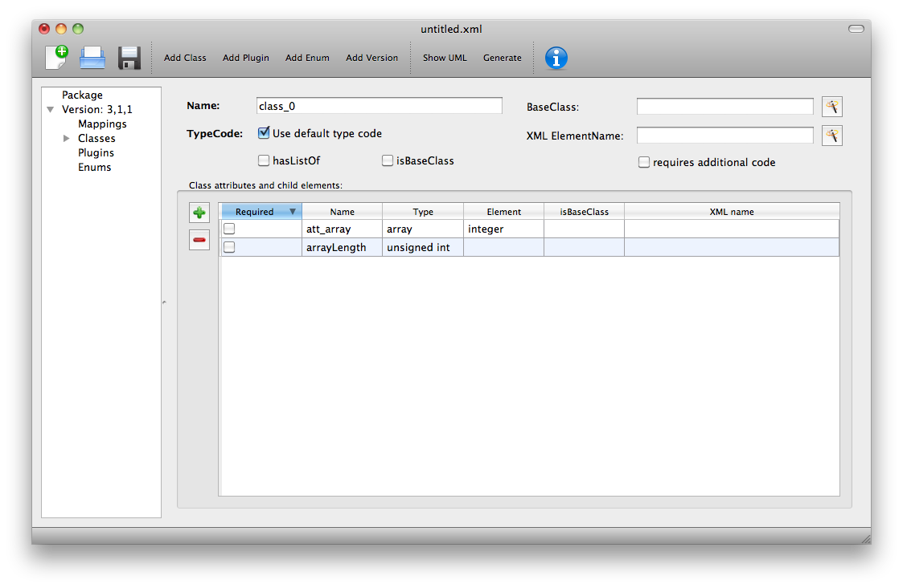

    Attributes of the SampledField class.

The code generator produces the following code for an attribute of type 'array':

.. code-block:: C++

   void    get[Name]    ([Type]* outArray)
   bool    isSet[Name]  ()
   int     set[Name]    ([Type]* inArray, int arrayLength)
   int     unset[Name]  ()
		
         where 
               [Type] 
                      is a placeholder for the appropriate C++ type
               [Name] 
                      is a placeholder for the attribute name 
                      given to the array

.. _enum:  
       
Attribute/child element type ‘enum’
^^^^^^^^^^^^^^^^^^^^^^^^^^^^^^^^^^^

An attribute can have a type corresponding to an enumeration type defined 
within the package. In this 
case the attribute has type 'enum' and would be defined as an entry with the 
following field values:

:Required: true/false as appropriate

:Name: the name to be used by code to store and manipulate this attribute

:Type: enum

:Element: the name of the enumeration

The enumeration is declared fully by adding an
enumeration to the package description (see `Add enum information`_).

.. _fig-array-enum:
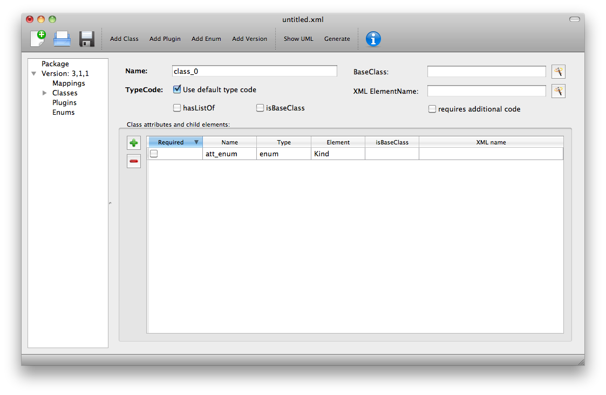

    Attribute of type 'enum'

The code generator produces the following code for an attribute of type 'enum':

.. code-block:: C++

   [EnumType_t]    get[Name]          ()
   std::string&    get{Name]AsString  ()
   bool            isSet[Name]        ()
   int             set[Name]          ([EnumType_t] value)
   int             set[Name]          (std::string& value)
   int             unset[Name]        ()
		
         where 
               [EnumType_t] 
                      is a placeholder for the C++ type of the enumeration
               [Name] 
                      is a placeholder for the attribute name 

It should be noted that libSBML convention uses an '_t' for all enumeration types.
This will be added by Deviser if necessary.

Attribute/child element type ‘element’
^^^^^^^^^^^^^^^^^^^^^^^^^^^^^^^^^^^^^^

This type can be used to define a child element of the defining class. The 
type 'element' refers to a single instance 
of another class that is a child of the defining class.

.. _SBML-snippet-event: 
   
   SBML snippet 3: An SBML Level 3 Core Event element.

.. code-block:: XML

   <event id="event1" name="event1" useValuesFromTriggerTime="true">
       <trigger initialValue="true" persistent="true">
           <math xmlns="http://www.w3.org/1998/Math/MathML">
               <apply>
                   <lt/>
                   <ci> S1 </ci>
                   <cn> 0.1 </cn>
               </apply>
           </math>
       </trigger>
       <listOfEventAssignments>
           <eventAssignment variable="S1">
               <math xmlns="http://www.w3.org/1998/Math/MathML">
                  <cn type="integer"> 1 </cn>
               </math>
           </eventAssignment>
       </listOfEventAssignments>
   </event>

.. todo::
   Add deviser screenshot showing a class with a child element/lo\_element as in event sbml and correct figure ref below

:ref:`SBML snippet 3 above<SBML-snippet-event>` shows an Event from SBML Level 3 Core
which has a Trigger child element. The Deviser Edit entries in the Attributes 
and child element table for the Event class are shown 
in Figure TBC. 

:ref:`Table 1<table1>`
gives examples of the expected XML and the functions produced for type 'element'.

Attribute/child element type ‘lo\_element’
^^^^^^^^^^^^^^^^^^^^^^^^^^^^^^^^^^^^^^^^^^

This type is used to define a child that is an instance of a 'ListOf' class. In
the :ref:`SBML Event<SBML-snippet-event>` shown the listOfEventAssignments is
defined as a child of type 'lo\_element' (see Figure TBC). :ref:`Table 1<table1>` 
details the corresponding XML output and functions generated.

.. _table1:

   Table 1: The XML output and generated functions for each of the Deviser
   child element types.

+-------------------------+------------------------------+----------------------------------------+
| **Type**                | **XML output**               | **Functions**                          |
+=========================+==============================+========================================+
| **element**             | <container>                  | getParameter()                         |
|                         |                              |                                        |
|                         | <parameter attributes= …/>   | isSetParameter()                       |
|                         |                              |                                        |
|                         | </container>                 | setParameter(Parameter\*)              |
|                         |                              |                                        |
|                         |                              | unsetParameter()                       |
|                         |                              |                                        |
|                         |                              | createParameter()                      |
+-------------------------+------------------------------+----------------------------------------+
| **lo\_element**         | <container>                  | getListOfParameters()                  |
|                         |                              |                                        |
|                         | <listOfParameters>           | getParameter(index) getParameter(id)   |
|                         |                              |                                        |
|                         | <parameter attributes= …/>   | addParameter(Parameter\*)              |
|                         |                              |                                        |
|                         | <parameter attributes= …/>   | getNumParameters()                     |
|                         |                              |                                        |
|                         | …                            | createParameter()                      |
|                         |                              |                                        |
|                         | </listOfParameters>          | removeParameter(index)                 |
|                         |                              |                                        |
|                         | </container>                 | removeParameter(id)                    |
+-------------------------+------------------------------+----------------------------------------+
| **inline\_lo\_element** | <container>                  | getListOfParameters()                  |
|                         |                              |                                        |
|                         | <parameter attributes= …/>   | getParameter(index) getParameter(id)   |
|                         |                              |                                        |
|                         | <parameter attributes= …/>   | addParameter(Parameter\*)              |
|                         |                              |                                        |
|                         | …                            | getNumParameters()                     |
|                         |                              |                                        |
|                         | </container>                 | createParameter()                      |
|                         |                              |                                        |
|                         |                              | removeParameter(index)                 |
|                         |                              |                                        |
|                         |                              | removeParameter(id)                    |
+-------------------------+------------------------------+----------------------------------------+

Attribute/child element type ‘inline\_lo\_element’
^^^^^^^^^^^^^^^^^^^^^^^^^^^^^^^^^^^^^^^^^^^^^^^^^^

On occasion an element may contain multiple children of the same type
which are not specified as being within a listOf element. From a code
point of view it is easier to consider these children as being within a
listOf element as this provides functionality to access and manipulate
potentially variable numbers of child elements. The
‘inline\_lo\_element’ type allows the user to specify that there are
multiple instances of the same child element but that these do not occur
within a specified ListOf element. :ref:`Table 1<table1>` gives examples of the
expected XML and the functions produced.

.. _elementfield:

The attribute/element **Element** field
***************************************

The **Element** field provides additional information depending on the
type of the attribute/child element being described. :ref:`Table 2<table2>` 
describes how and when this field
should be populated. Note the ‘name’ of an element or object refers to
the ClassName of the appropriate object.

 .. _table2:

    Table 2: The expected entries in the 'Element' field depending on the 'Type'.

+-----------------------+---------------------------------------------------+
| **Type**              | **Element field**                                 |
+=======================+===================================================+
| array                 | type of data within the array                     |
+-----------------------+---------------------------------------------------+
| enum                  | The name of the enumeration                       |
+-----------------------+---------------------------------------------------+
| element               | The class name of the element                     |
+-----------------------+---------------------------------------------------+
| lo\_element           | The class name of the element within the ListOf   |
+-----------------------+---------------------------------------------------+
| inline\_lo\_element   | The class name of the element                     |
+-----------------------+---------------------------------------------------+
| SIdRef                | Comma separated list of the class name of         |
|                       | multiple objects that can be referenced           |
+-----------------------+---------------------------------------------------+
| Any other             | blank                                             |
+-----------------------+---------------------------------------------------+

   .. _astnode:

Note that Deviser does
specifically recognize the elements ASTNode and XMLNode and treats them
appropriately as elements that will contain either MathML or XML content
respectively. Other class names that are listed are assumed to be parsed as 
classes
belonging to libSBML; either those being defined by this package or ones
defined in L3 core or other available L3 package code. Deviser Edit will
prompt users for this information in the section on `Mappings`_.

The attribute/element **isBaseClass** field
********************************************

The **isBaseClass** field indicates that the child element is a base
class and not instantiated directly. This is a situation that will not
commonly occur but happens when there is multiple nesting of classes.
The current ‘spatial’ package defines a CSGTransformation that inherits
from CSGNode but also contains an element of that type 
(see Figure :num:`fig-csgtransform-uml` and
Figure :num:`fig-csgtransform-deviser`).

.. _fig-csgtransform-uml:
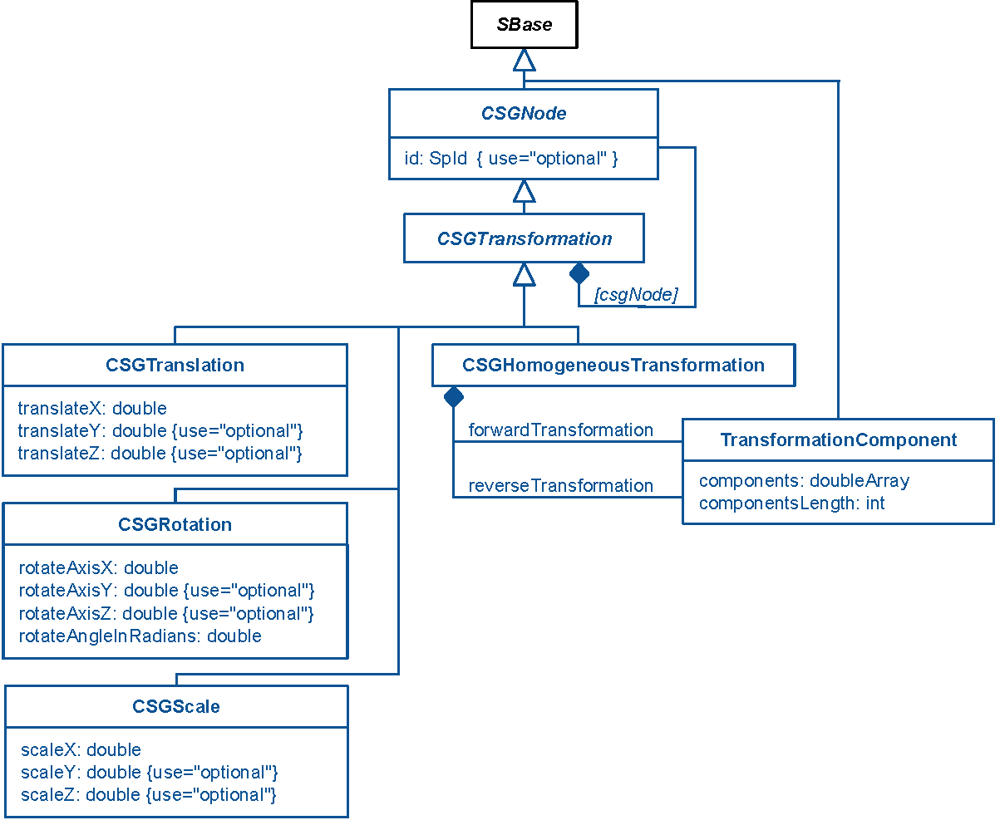

     UML diagram of CSGTransformation from SBML L3 'spatial' package specification

.. _fig-csgtransform-deviser:
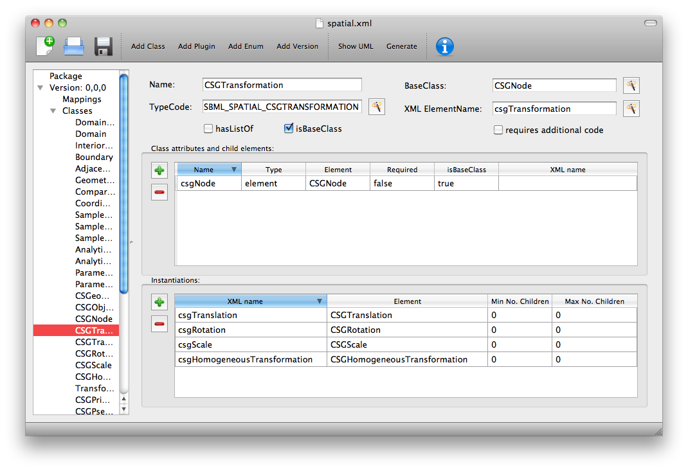

     Deviser Edit description of CSGTransformation

Note that the child element ‘csgNode’ has been marked as a base class.
This tells Deviser to generate code relevant to the instantiations of
the CSGNode class rather than for a concrete CSGNode child. For example,
instead of getting a ‘createCSGNode()’ function, you would get create
functions for all the instantiations of the base class:
createCSGTransformation(); createCSGPrimitive() etc.

The attribute/element **XML Name** field
****************************************

The **XML name** field can be used to specify the name of the element as
it will appear in the XML output where this may differ from the Name
field. For attributes it is unlikely that the Name used will differ from
the XML name; however if the object being listed is an element or listOf
element there may be situations where they differ – as in 
:ref:`Example 2<example2>` below.

.. raw:: latex

  \clearpage

.. _listof:

Adding further ListOf information
~~~~~~~~~~~~~~~~~~~~~~~~~~~~~~~~~~

When the **hasListOf** checkbox is selected four other fields appear.

The listof **ListOfClassName** field
*************************************

The **ListOfClassName** is the name used in code for the class
representing the ListOf object. It need only be populated if the
default of ‘ListOfBars’ is inappropriate.

The listof **XML ListOfName** field
*************************************

The **XML ListOfName** field is the XML name for the list of objects. It
only needs to be populated if there is a difference in name between XML
and code. It will default to ‘listOfBars’ where ‘Bar’ is the class name.

The listof **Minimum number of children** field
************************************************

The **Minimum number of children** field is used to indicate the minimum
number of child objects of type Bar a ListOfBars expects. Currently in
SBML L3 ListOf elements cannot be empty so this will default to '1'.

The listof **Maximum number of children** field
************************************************

The **Maximum number of children** field is used to indicate the maximum
number of child objects a ListOf expects. Leaving this blank implies
there is no stated maximum value for the number of children.

The **ListOf attributes** table (which has the same fields as the table
for entering class attributes and child elements) allows you to add
attributes to the ListOf class. This table could also be used in the very rare
case where a listOf element contains a child that is not the same type as 
the expected children. For example the Qualitative Models Package defines 
a listOfFunctionTerms that must contain one instance of a defaultTerm in 
addition to the functionTerm children.

.. raw:: latex

  \clearpage

.. _instants:

Adding instantiations information
~~~~~~~~~~~~~~~~~~~~~~~~~~~~~~~~~~

When the isBaseClass checkbox is selected the
**Instantiations** table then appears.

The **Instantiations** table allows you to specify the class(es) that
will be derived from this base class. Note Deviser Edit expects these to
be listed here – even if the information could be determined elsewhere.
Entries in this table do not define a class, the definition of the class
should be created as a separate class entry. Only classes that directly
inherit from this class need be listed; it may be that the classes
listed are themselves base classes for further classes. These should be
listed as the Instantiations on the relevant base class description.

.. _inst-name:

The instantiations **XML Name** field
**************************************

The **XML name** field specifies the XML name of the object. This is a required
field and must have a value.

.. _inst-element:

The instantiations **Element** field
*************************************

The **Element** field specifies a class that will be derived from this
base class. This is a required field and should be the name of a Class defined
within the package.

The instantiations **Min No. Children** field
**********************************************

The **Min No. Children** field is used to specify a minimum number of
children that this element may have.

The instantiations **Max No. Children** field
**********************************************

The **Max No. Children** field is used to specify the maximum number of
children.

Note that sometimes a specific instantiation adds further requirements.
For example, where one class may contain children of the same base class
there may be a requirement that it contains a certain number of children
as with Associations in the FBC package an FBCAnd instantiation MUST
have two children. Where there are no such requirements these fields
should be left as ‘0’.

.. raw:: latex

  \clearpage

A note on repeated information
~~~~~~~~~~~~~~~~~~~~~~~~~~~~~~

Users may become aware of the fact that at times they are entering
duplicate information. For example if a child element is used that does
not have the default XML Name then this will be declared both when
describing the Class for that element AND when listing the child element
occurrence (see :ref:`Example 2<example2>`). Also, classes derived from a 
base class are
listed as Instantiations of that class when it would be possible to work
out this information from the BaseClass information given for each
class.

Deviser Edit **does require this information to be duplicated** as this
facilitates the storing of unfinished definitions and allows the
definition to be validated to some extent. It also means that each sheet
contains all the pertinent information for the Class being specified
rather than this information being distributed across various sheets in
the GUI.

.. raw:: latex

  \clearpage

.. _example1:

Example 1 - Adding a class with no containing ListOf
~~~~~~~~~~~~~~~~~~~~~~~~~~~~~~~~~~~~~~~~~~~~~~~~~~~~

Here we define the KineticLaw class for our imaginary package ‘foo’.

.. _fig-foo-kl:
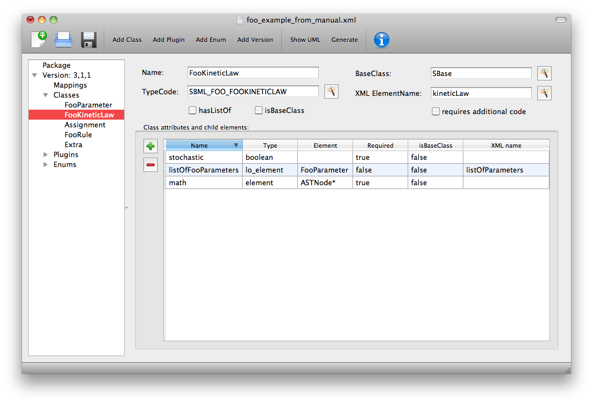

     Defining the FooKineticLaw class.

We know that libSBML already contains a class KineticLaw and so we use a
class name that reflects the package and class i.e. ‘FooKineticLaw’ and
we specify that the XML ElementName will be ‘kineticLaw’. Thus the
generated code will use a class ‘FooKineticLaw’ that will not conflict
with existing libSBML classes but would output this in XML as an element
<foo:kineticLaw>. This causes no conflict as XML Namespaces keep
elements completely separate.

Our class has three attributes/child elements.

The first is a boolean attribute called ‘stochastic’, which is
mandatory. So we add the name ‘stochastic, the type ‘boolean’ and change
the required status to ‘true’.

The second child is a ListOfParameters. Again we know that name will
conflict with the class ListOfParameters so we add the name
‘listOfFooParameters’, the type ‘lo\_element’, the element
‘FooParameter’ and state that the XML name is ‘listOfParameters’. Note
that we will need to specify the class FooParameter later on; which we
do in :ref:`Example 2<example2>`.

The third child is a math element. So we add the name ‘math’, the type
‘element’ and the element ‘ASTNode\*’. :ref:`As mentioned above<astnode>` 
Deviser does
specifically recognize the elements ASTNode and XMLNode.

.. raw:: latex

  \clearpage

.. _example2:

Example 2 - Adding a class with a containing ListOf
~~~~~~~~~~~~~~~~~~~~~~~~~~~~~~~~~~~~~~~~~~~~~~~~~~~

Here we specify the FooParameter class used by the FooKineticLaw that we
specified in :ref:`Example 1<example1>`.

.. todo::
   Update figure

.. _fig-foo-param:
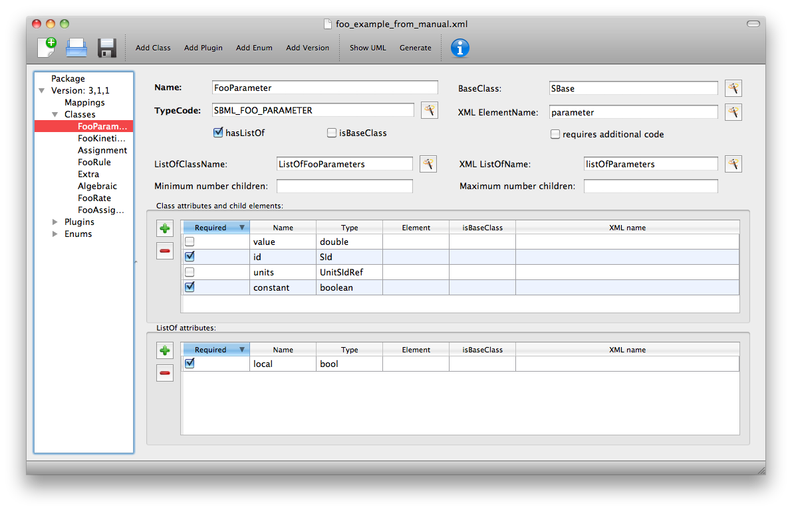

     Defining the FooParameter class.

The **hasListOf** checkbox has been selected the additional
fields appear.

In our example we have populated the **ListOfClassName** and  **XML ListOfName**
fields as we have used a class
name ‘FooParameter’ but want to have XML names of ‘parameter’ and
‘listOfParameters’.

Figure :num:`fig-uml-foo-kl` shows the UML diagram produced by Deviser Edit of the package
‘foo’ as described so far in examples 1 and 2 while the corresponding
SBML is shown in :ref:`SBML snippet 4<sbml-4>`.

.. _fig-uml-foo-kl:
.. figure:: ../figures/deviser-uml-foo-kl.png

   The UML diagram produced by Deviser Edit following the definition of package 'Foo' in Examples 1 and 2

.. _sbml-4: 
   
   SBML Snippet 4: The 'foo' kineticLaw element as defined in Examples 1 and 2.

.. code-block:: XML

    <foo:kineticLaw foo:stochastic="false">
        <foo:listOfParameters foo:local="true">
            <foo:parameter foo:id="p1" foo:constant="true"/>
        </foo:listOfParameters>
        <math xmlns="http://www.w3.org/1998/Math/MathML">
            ...
        </math>
    </foo:kineticLaw>

.. raw:: latex

  \clearpage

Example 3 – Adding a base class and derived classes
~~~~~~~~~~~~~~~~~~~~~~~~~~~~~~~~~~~~~~~~~~~~~~~~~~~

Here we define a class that will be used as a base class for others (see
Figure :num:`fig-foo-rule`).

.. _fig-foo-rule:
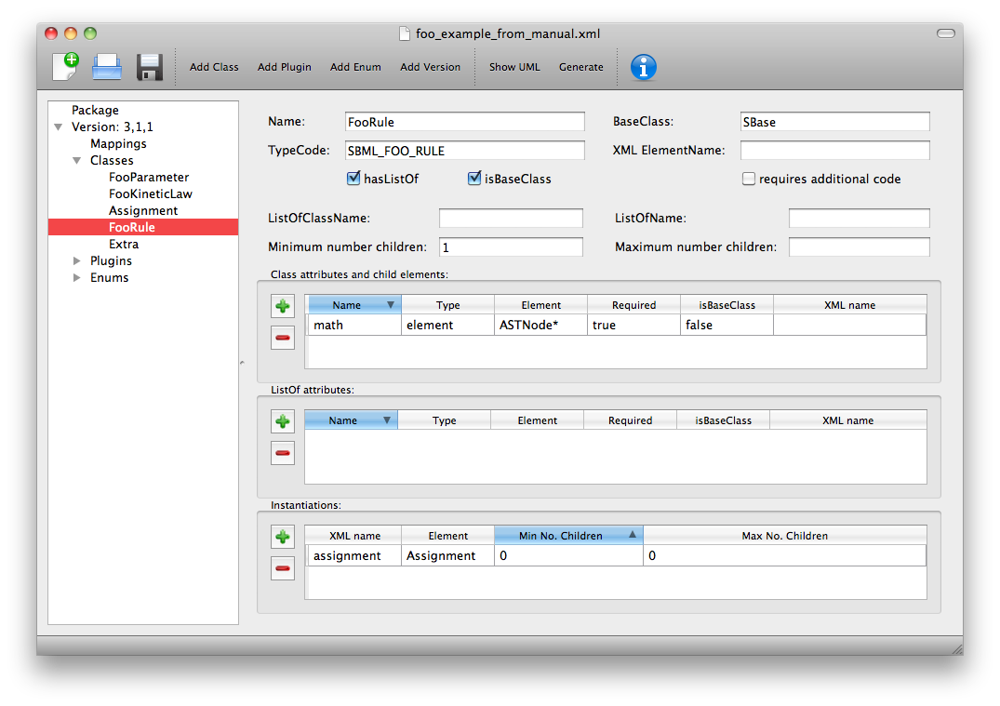

     Defining the base class ‘FooRule’.

This class is named FooRule and has a corresponding ListOf element. Note
we have not filled in any alternative names so we will expect to get an
element called listOfFooRules in the XML.

This class is a base class and we tick the isBaseClass checkbox. The
**Instantiations** table then appears.

Here we have specified that the ListOfFooRules may contain objects of
type Assignment or Algebraic. We specify Algebraic as a new class in
Figure :num:`fig-foo-algebraic` and Assignment in Figure :num:`fig-foo-assignment`.

.. _fig-foo-algebraic:
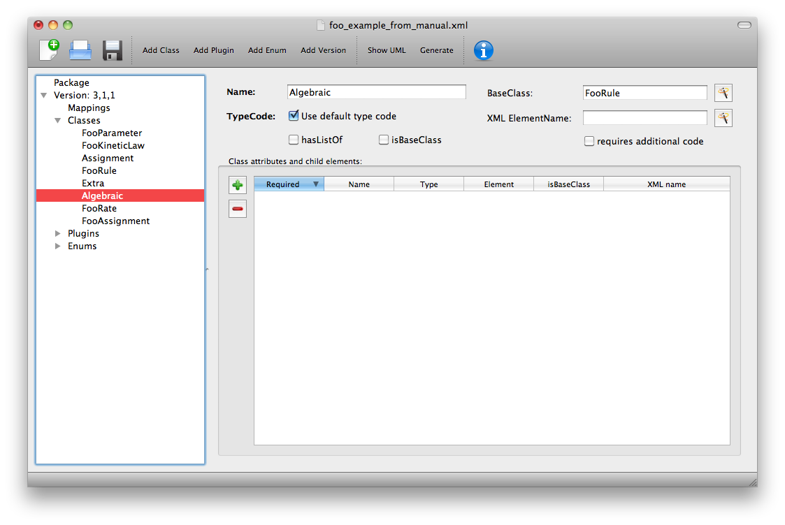

     Defining the Algebraic class

Note that we have changed the BaseClass field to FooRule.

.. _fig-foo-assignment:
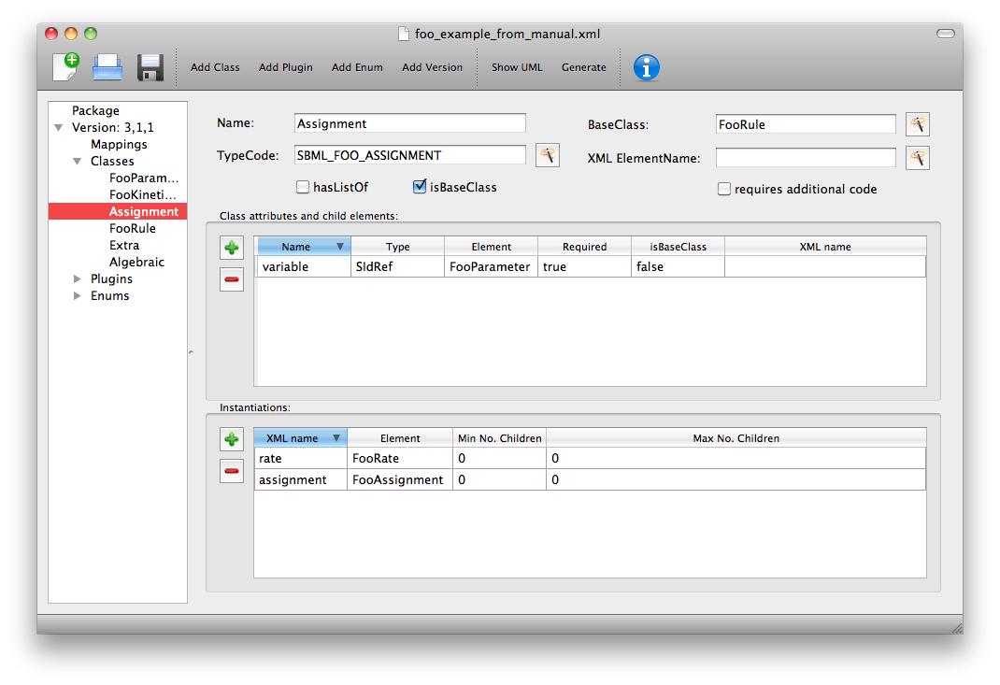

     Defining the Assignment class.

The Assignment class illustrates a slightly more complex scenario. Here
it derives from the baseClass FooRule and adds an attribute ‘variable’
that is a reference to a FooParameter. It have also acts as a base class
for two further classes FooRate and FooAssignment. Figure :num:`fig-uml-foo-rules` shows the
hierarchy and :ref:`SBML snippet 5<sbml-5>` the resulting XML.

.. _fig-uml-foo-rules:
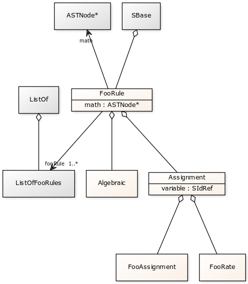

     The UML diagram from Deviser Edit of the ListOfFooRules class

.. _sbml-5: 
   
   SBML Snippet 5: The listOfFooRules element as defined in Example 3.

.. code-block:: XML

    <foo:listOfFooRules>
        <foo:assignment foo:variable="p">
            <math xmlns="http://www.w3.org/1998/Math/MathML">
                ...
            </math>
        </foo:assignment>
        <foo:rate foo:variable="s">
            <math xmlns="http://www.w3.org/1998/Math/MathML">
                ...
            </math>
        </foo:rate>
        <foo:algebraic>
            <math xmlns="http://www.w3.org/1998/Math/MathML">
                ...
            </math>
        </foo:algebraic>
    </foo:listOfFooRules>

.. raw:: latex

  \clearpage

Add plugin information
----------------------

What is a plugin ?
~~~~~~~~~~~~~~~~~~

In order to extend SBML Level 3 Core with a package not only is it
necessary to define new classes, it is also necessary to attach these
elements to an existing point in an SBML model. The simplest case would
be that a new element is added to the containing <sbml> element but the
point of extension may be much further embedded within the SBML. Here
(and indeed within libSBML) we use the term ‘plugin’ to specify the
necessary information that links the new package classes with other
classes. Code for any given class in any relevant function then checks
whether it has a plugin attached and passes control to the plugin if
necessary. Figure 18 shows two plugins on the Model class, one by the
‘qual’ package and the other by the ‘fbc’ package. Note the names
reflect the package and the object being extended.

.. _fig-libsbml-plugin:
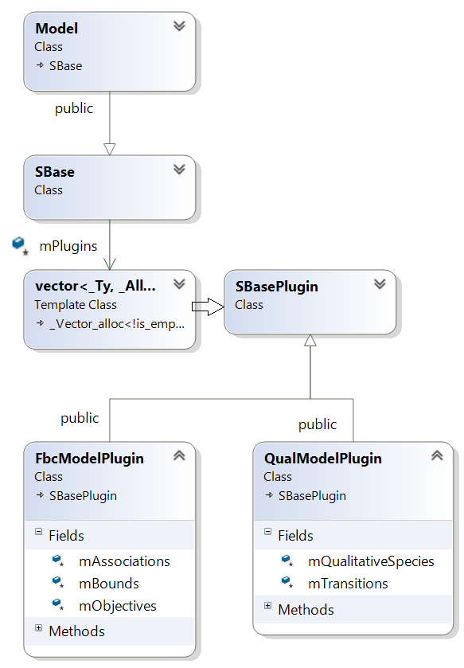

     libSBML class hierarchy showing ‘plugins’ to the Model class

.. raw:: latex

  \clearpage

General plugin information
~~~~~~~~~~~~~~~~~~~~~~~~~~

Plugin information describes the elements that are extended by the new
classes defined within a package. The elements to be extended may come
from SBML Level 3 Core or another SBML Level 3 package.

Select ‘Add Plugin’ from the toolbar or the ‘Edit’ menu.

.. _fig-add-plugin:
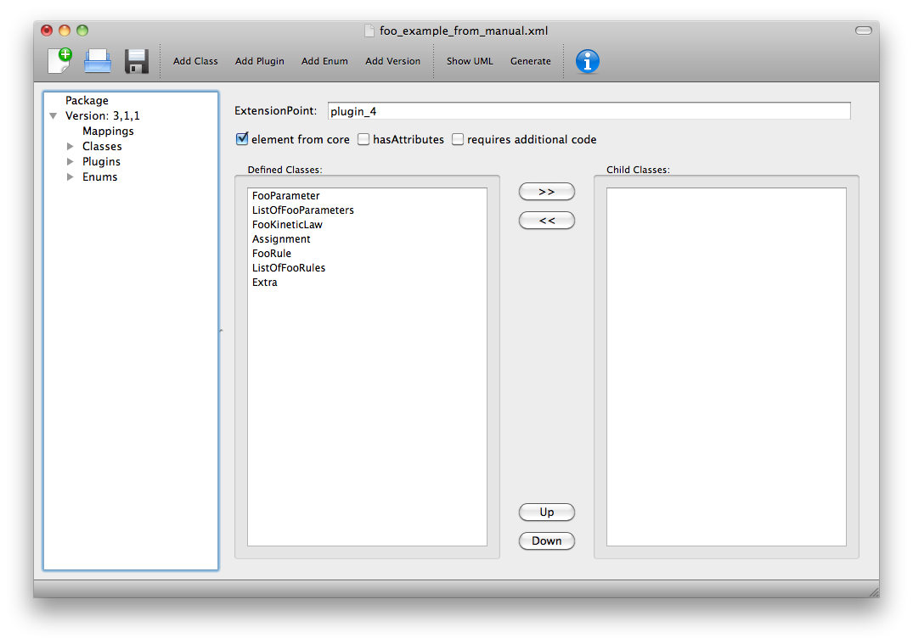

     The ‘Plugin’ sheet.

The Plugin **ExtensionPoint** field
************************************

The **ExtensionPoint** field is used to specify the name of the element
that is being extended. This will be the name of the class as used by
libSBML.

The Plugin **element from core** checkbox
******************************************

The **element from core** checkbox is used to specify whether the object
being extended originates in SBML Core or another Level 3 package. It is checked 
by default as to date the majority of SBML L3 packages have only extended 
elements from SBML core. Unchecking the box reveals the **Package** and 
**TypeCode** fields discussed below.

The Plugin **hasAttributes** checkbox
**************************************

The **hasAttributes** checkbox should be ticked if the package is going
to extend an object with attributes rather than (or as well as)
elements.

The Plugin **requires additional code** checkbox
*************************************************

.. todo::
    Update additional code stuff

As on other sheets the **requires additional code** checkbox can be used
to indicate that there is additional code that will be required by the
package that will not be generated by Deviser. Checking the ‘requires
additional code’ box reveals further boxes that can be used to specify
the location of the additional code files. Deviser will incorporate this
code ‘as-is’.

The Plugin **Defined Classes** and **Child Classes** boxes
***********************************************************

The sheet for adding a plugin lists the classes that have already been
specified (**Defined Classes**) and are ‘available’ to extend an object.
These can be selected and moved into the **Child Classes** column.

The **Up** and **Down** buttons can be used to reorder the classes that have
been added as extensions for the given extension point. This will impact the 
order in which Deviser deals with plugins and thus will affect typecode 
enumerations and the order in which plugin objects are documented.

Adding other package information
********************************

The plugin **Package** field
^^^^^^^^^^^^^^^^^^^^^^^^^^^^^

In cases where the **ExtensionPoint** does not originate in SBML L3 Core 
Deviser needs to know in which L3 Package the class does originate.

The plugin **TypeCode** field
^^^^^^^^^^^^^^^^^^^^^^^^^^^^^^^^

In cases where the **ExtensionPoint** does not originate in SBML L3 Core 
Deviser also needs to know the TypeCode that libSBML has used for the 
object being extended. It will be necessary for the user to consult libSBML 
documentation (or code) to determine this value.

.. raw:: latex

  \clearpage

Example 4 – Extending a core element
~~~~~~~~~~~~~~~~~~~~~~~~~~~~~~~~~~~~

Here we are going to specify that the ‘foo’ package extends the SBML
Level 3 Core Reaction with the new FooKineticLaw class.

.. _fig-plugin-react:
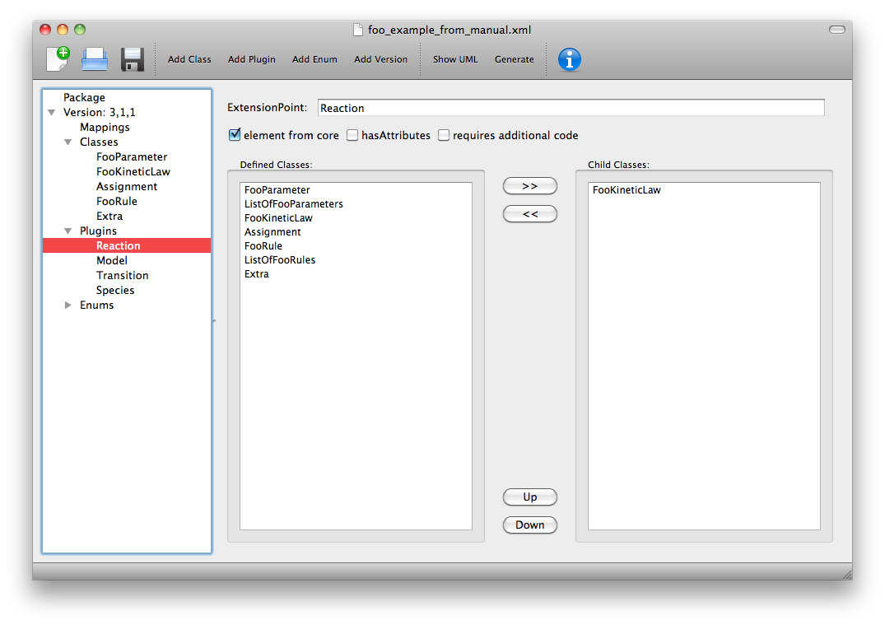

     Defining the extension of SBML Level 3 Core Reaction by package foo.

We fill in the **ExtensionPoint** with ‘Reaction’, tick the checkbox to
note that the element is from core. Highlight FooKineticLaw in the
**Defined Classes** column and use the arrows to move it to the **Child
Classes** column. Essentially this is telling Deviser to generate the
class FooReactionPlugin which will expect to have a data member of type
FooKineticLaw class and the functions necessary to create and manipulate it 
(as shown below).

.. code-block:: C++

    class LIBSBML_EXTERN FooReactionPlugin : public SBasePlugin
    {
    protected:
      FooKineticLaw* mFooKineticLaw;
    public:
      const FooKineticLaw* getFooKineticLaw() const;
      bool isSetFooKineticLaw() const;
      int setFooKineticLaw(const FooKineticLaw* fooKineticLaw);
      FooKineticLaw* createFooKineticLaw();
      int unsetFooKineticLaw();
      ...
    }

.. raw:: latex

  \clearpage

Example 5 – Extending a core element with attributes only
~~~~~~~~~~~~~~~~~~~~~~~~~~~~~~~~~~~~~~~~~~~~~~~~~~~~~~~~~

Here we declare that the **ExtensionPoint** is Model from core and tick
the **hasAttributes** checkbox.

The table **Child attributes and child elements** appears. This is used
for adding attributes and child elements as previously described. Here
we specify that the Model will have a required boolean attribute
‘useFoo’ from the foo package (Figure :num:`fig-plugin-model`). Note that it is not necessary
to specify child elements that originate in the package being defined
as these that have already been listed as **Child classes**.

.. _fig-plugin-model:
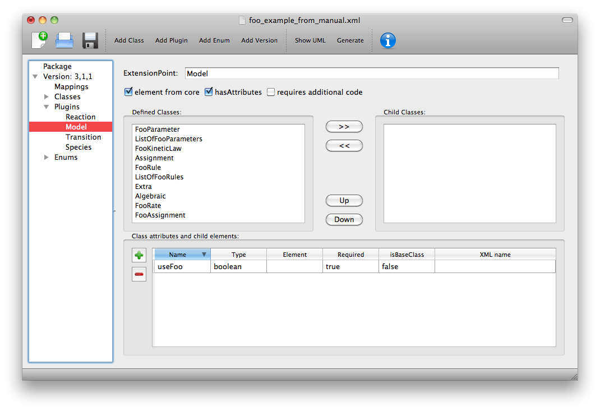

     Defining the extension of SBML Level 3 Core Model by package foo.

.. raw:: latex

  \clearpage

Example 6 – Extending a non-core element
~~~~~~~~~~~~~~~~~~~~~~~~~~~~~~~~~~~~~~~~

Here we declare that the **ExtensionPoint** is Transition from the
Qualitative Models (qual) Package. Unchecking the **element from core** checkbox
reveals the **Package** and **TypeCode** fields which have been filled in as 
appropriate. The package 'foo' adds the
ListOfFooRules object to the Transition object.

.. _fig-plugin-trans:
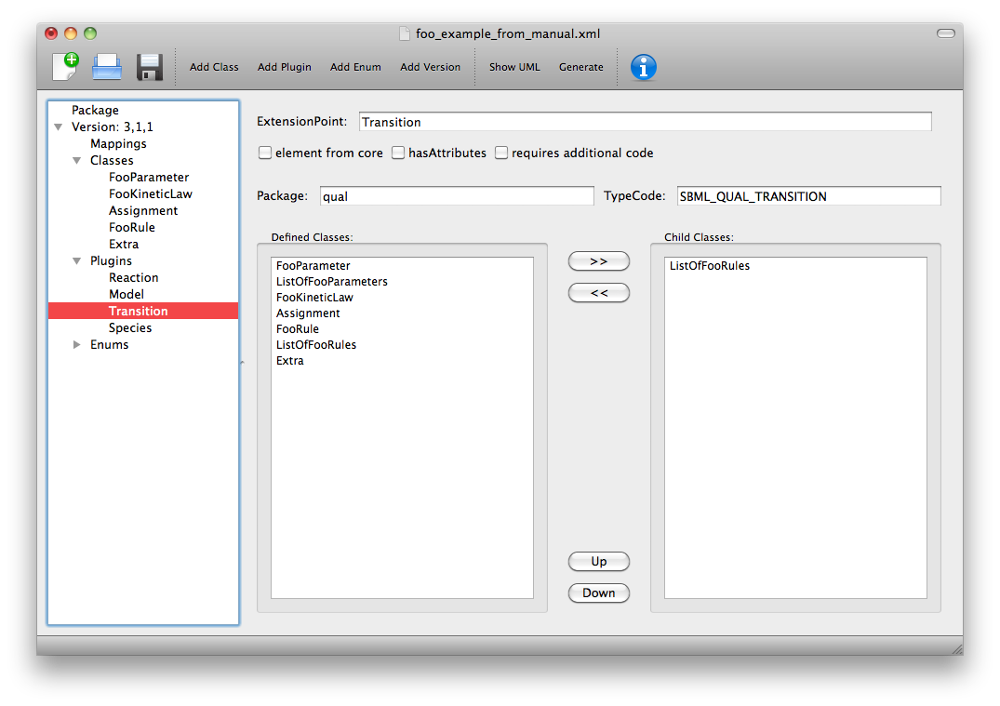

     Defining the extension of SBML Level 3 Qual Transition by package foo.

.. raw:: latex

  \clearpage

Add enum information
--------------------

SBML allows users to define data types as enumerations of allowed
values. Section :ref:`enum` describes using 'enum' as an attribute **Type**. 
Here we describe how to fully specify the enumeration.

General enum information
~~~~~~~~~~~~~~~~~~~~~~~~~

The Enum **Name** field
***********************

The **Name** field is used to declare the name of the enumeration, in
this case Sign. Note that when generating code Deviser will append an
‘\_t’ to this name if it does not already have a name of the format Name\_t.

.. _enum_name:

The Enum **Name/Value** table
******************************
The table is used to specify the individual allowed values of the
enumeration.

The enum table **Name** field
^^^^^^^^^^^^^^^^^^^^^^^^^^^^^^
The **Name** field is the enumeration value that will appear in the
enumeration itself.

The enum table **Value** field
^^^^^^^^^^^^^^^^^^^^^^^^^^^^^^
The **Value** field gives the corresponding string value of that member
of the enumeration.

Each entry must have both a **Name** and a **Value**.

The Enum Quick Add field
************************

This field can be used to facilitate creating the enumeration Name-Value pairs. 
Enter the string value in this field and press the 'wand'. The string will be
added as an enumeration **Value** with a **Name** of PACKAGE\_ENUM\_VALUE.

Example 7 – Adding an enumeration
~~~~~~~~~~~~~~~~~~~~~~~~~~~~~~~~~

.. _fig-foo-extra:
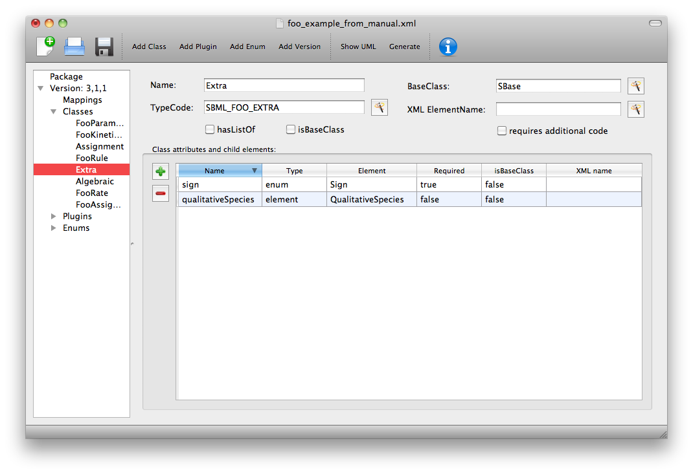

      Defining the Extra class which has an attribute of type enum.

Assume we have an object ‘extra’ that has an attribute called ‘sign’
which is of an enumeration type ‘Sign’. Firstly we define the class
‘Extra’ and specify the attribute. In this case the **Type** of the
attribute is ‘enum’ and the **Element** field gives the name of the
enumeration type ‘Sign’ as shown in Figure :num:`fig-foo-extra`.

Then it is necessary to specify the enumeration itself. Use the **Add
Enum** button from the toolbar or Edit menu.

The **Name** filed is Sign (which corresponds to the **Element** field in 
the attribute table). Figure :num:`fig-enum-sign` shows that we have specified 
that the enumeration sign has three
possible values: ‘positive’, ‘negative’ and ‘neutral. Note we used the 
**Quick Add** field to enter 'neutral' which resulted in the enumeration
FOO\_SIGN\_NEUTRAL.

It is not necessary to add 
a default or “unknown” value –
Deviser will do this when generating code.

.. _fig-enum-sign:
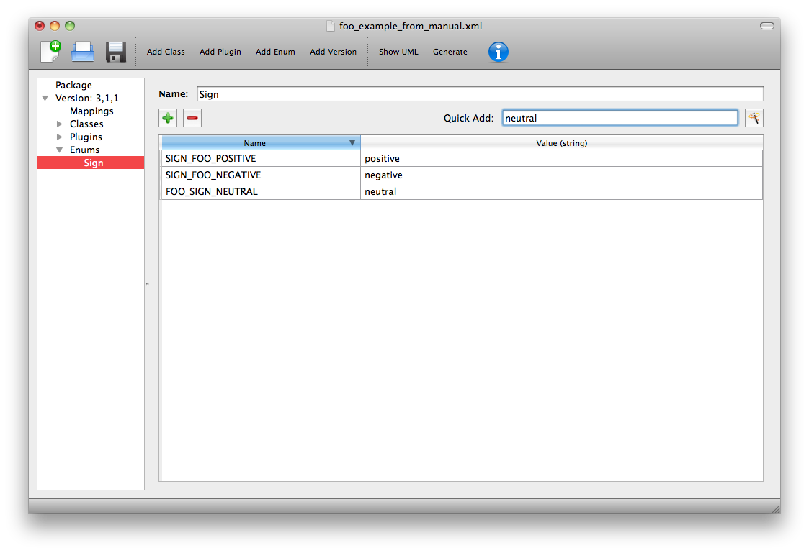

     Defining the Sign enumeration.

.. raw:: latex

  \clearpage

Mappings
--------

Once the class and plugin descriptions are complete the Deviser Edit
tool will determine if there are any classes present that do not
originate from core or the package being described. Select ‘Mappings’
from the tree in the panel on the left hand side. The tool will have
prepopulated this with any relevant classes and all that remains is for
the package information to be filled in.

.. _fig-foo-mappings:
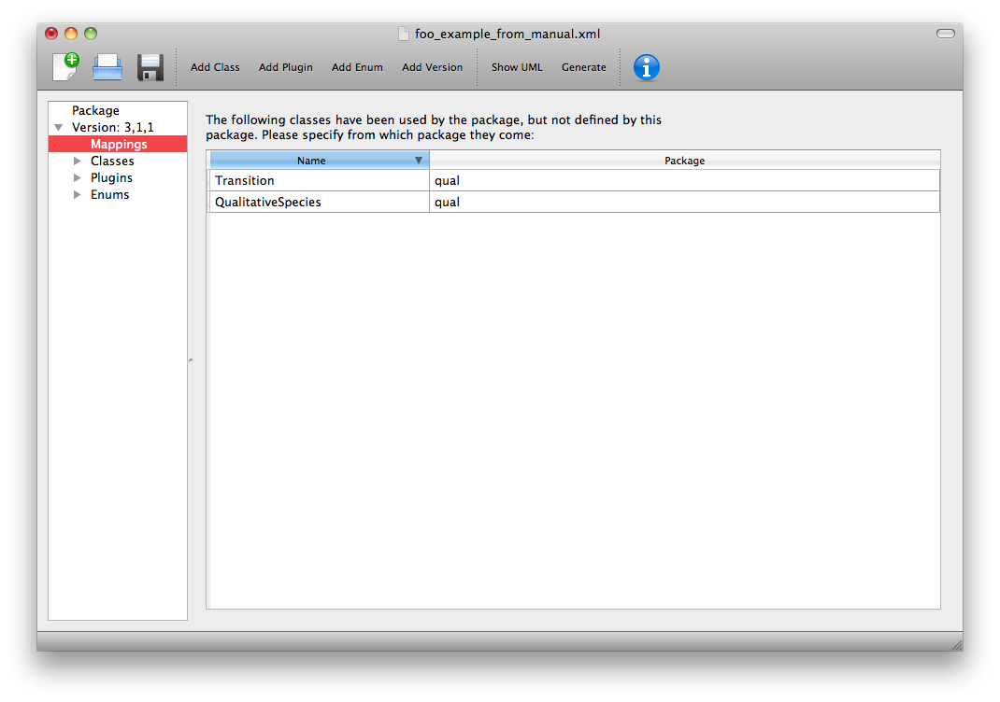

     Identifying the origin of classes from other packages

The **Package** field is used to add the name of the package in which
the class given in the **Name** field originates. In our example we have
used the Transition and QualitativeSpecies classes both of which
originate in the ‘qual’ package, so this information is added. Note on
this sheet only the **Package** column can be edited. The **Name**
column is populated by the tool.

.. raw:: latex

  \clearpage

Overview of a defined package
------------------------------

Select ‘Version’ from the tree in the panel on the left hand side. Now
that all the classes have been defined these are listed here (see Figure
:num:`fig-full-decsr`) and the ordering can be adjusted. The order will dictate the order
of the relevant sections in the TeX documents.

.. _fig-full-decsr:
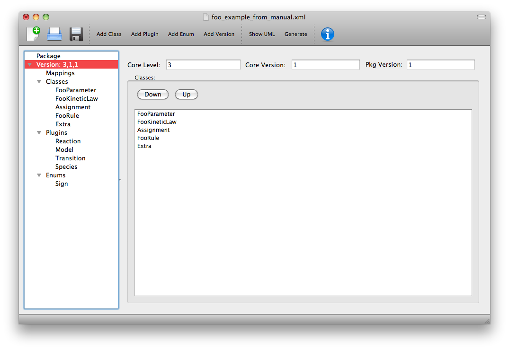

     The complete description of the foo package

The Deviser Edit tool creates an XML description from the definition
that is used by other code to generate UML, TeX and libSBML code.

Note this underlying XML file can be saved at any point and reopened
using Deviser Edit or with any XML Editor. The full description of the
Imaginary Foo Package used in the Examples can be seen in :ref:`descrip` or
is available in the deviser/samples directory.

.. raw:: latex

  \clearpage

Validating the description
~~~~~~~~~~~~~~~~~~~~~~~~~~

There are two further options on the Edit menu that have not yet been
discussed.

.. _validate:

The **Validate Description** option
************************************
 
**Validate Description** runs a series of internal checks on the
information provided and produces a list of Errors and Warnings.
When invoked a pop-up window (Figure :num:`fig-validation`) will appear with 
either a list of errors and/or warnings or
a confirmation that everything is consistent. The Copy button can be
used to copy the contents of the report to the clipboard and thus makes
them available for pasting elsewhere.

.. _fig-validation:
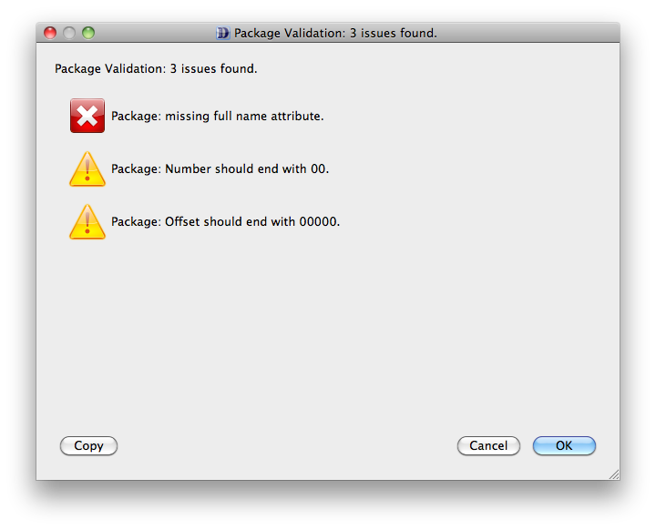

     Validating the package description

:ref:`validation` gives a list of the errors and warnings that may be issued 
by Deviser Edit with references to teh relevant sections in teh main text. 

The **Fix Errors** option
**************************

**Fix Errors** provides a direct way of validating and then correcting
any inconsistencies. Deviser Edit will run the validation checks and then 
automatically correct any issues, where this is possible. 
It is advisable to use **Validate Description**
following **Fix Errors** as some errors cannot be automatically fixed.

.. _mult-vers:

Defining multiple versions of a package
---------------------------------------

Deviser code generation neatly handles multiple versions of a package.

.. todo::
    Note on latex

Each version must be specified completely. Using the **Add Version** button
from the menu or toolbar will create a second version that can be populated
in the same way as described in this manual.

Since new versions of a package are likely to resemble existing versions the
entire version can be duplicated by right-clicking on the Version header in the
tree view on the left panel and selecting **Duplicate** (see Figure :num:`deviser-util1`).  

.. _deviser-util1:
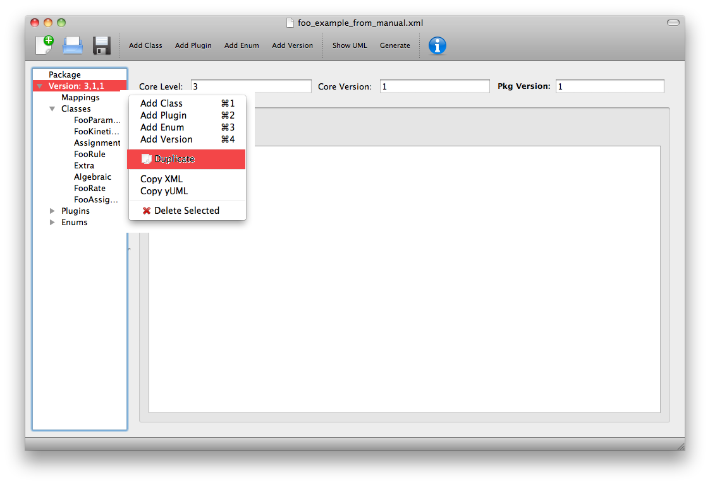

   Duplicating a version of a package.
 
This creates a complete copy of the previous package version and gives it the
next package version number (see Figure :num:`fig-foo-v2`). The individual 
objects can then be edited or removed as necessary and any additional objects
added.

.. _fig-foo-v2:
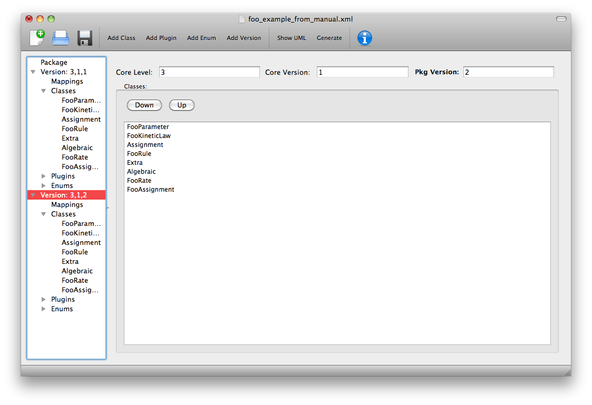

   A second version of the 'foo' package duplicated from Version 1. Note how 
   the classes listed reflect Version 1.

