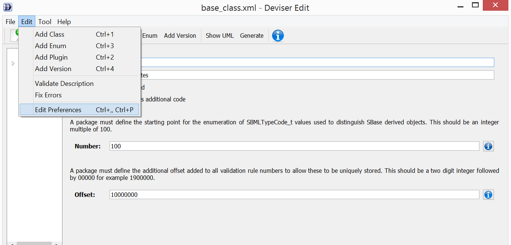
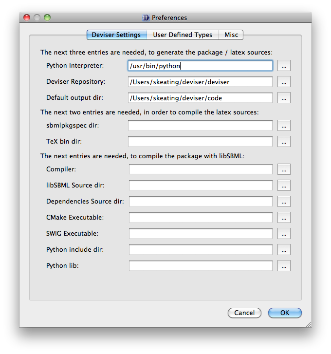
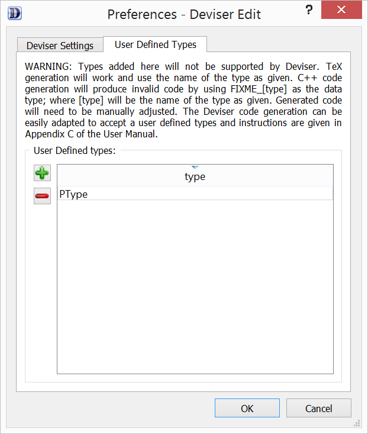
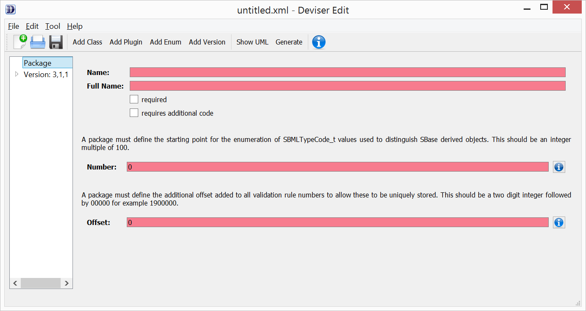

Getting started
===============

Deviser allows a user to define an SBML Level 3 (L3) package 
and produce libSBML
code that can be integrated with the existing libSBML source tree to add
libSBML support for the package.

Deviser can also use the package description to create basic
specification files for the package based on the LaTeX style SBMLPkgSpec
for SBML Level 3 package documentation.

The creation of both code and LaTeX files can be controlled via a
command-line interface.

The full Deviser package includes Deviser Edit; a graphical user interface (GUI) 
for defining the
necessary details of the package being defined. The GUI also provides a 
convenient way of invoking the
Deviser functionality to create code or LaTeX files. Other capabilities of 
Deviser Edit (view UML,
create PDF, integrate and test code) further aid the process of defining an 
SBML L3 package and testing the code generated by Deviser.

Functionality
-------------

The Deviser Edit tool outputs an XML definition of the SBML L3 package you have defined. This
definition is then used by Deviser to generate either code or LaTeX files.
Samples of definitions output by Deviser Edit are included in the *deviser\samples* 
directory within the Deviser distribution, and the full text of the XML definition 
created by
the examples used in this manual is given in :ref:`descrip`. Note it is not 
necessary to use Deviser Edit to produce this XML definition; the 
definition can be produced by hand but should match the format used
in the samples provided.

Using command line
~~~~~~~~~~~~~~~~~~

A command line interface is available to produce code files and LaTeX files.
This invokes the deviser.py function that is available in the *deviser/generator* 
directory of the Deviser distribution.

This is invoked as::

      deviser.py [--generate][--latex] input-file.xml

This program takes as input a Deviser XML file and either

- generates libSBML code for the package,
  when the command-line argument is ``--generate`` or ``-g``
- generates the LaTeX files for the package specification,
  when the command-line argument is ``--latex`` or ``-l``

.. raw:: latex

  \clearpage

Using Deviser Edit
~~~~~~~~~~~~~~~~~~

The basic Deviser Edit tool allows a user
to define an SBML L3 package by filling in requested information. 
Once defined, the following functions are
available:

1. Generate libSBML code for the package.

2. Integrate and test the package code within libSBML.

3. Generate LaTeX files for basic specification of the package.

4. Generate a PDF of a basic specification document for the package.

5. Create and view a UML diagram of the package specification.

.. _prereq:

Prerequisites
-------------

The main functionality (generating code or LaTeX files) is
invoked using a Python Interpreter (see :numref:`using`). This release of Deviser has been 
tested with Python 2.6, 2.7, 3.3 and 3.4. 
Other functions provided by Deviser Edit may require further
software. The prerequisites for each function are listed below.

Integration and testing
~~~~~~~~~~~~~~~~~~~~~~~

Deviser Edit allows you to automatically integrate and test your
newly created code with libSBML. In order to do this you will need to
have the following additional software installed/available:

-  CMake

-  SWIG 

-  a C++ compiler

-  libSBML source code

-  libSBML dependencies source code

Basic documentation
~~~~~~~~~~~~~~~~~~~

In order to create a PDF document of the package specification 
it will be necessary to have the following installed/available:

-  pdflatex

-  SBMLPkgSpec (the LaTeX style for SBML L3 package documentation)

Note that using pdflatex may involve installing other packages depending on the
operating system. 

On Windows we successfully used MiKTEX (MiKTeX (pronounced mick-tech) is an 
up-to-date implementation of LaTeX/LaTeX and related programs for Windows) see 
:numref:`links`.

UML diagrams
~~~~~~~~~~~~

Deviser allows you to create and view very basic UML diagrams based on
the classes specified. Since it uses the free yUML (http://yuml.me/) web
service, it will be necessary to be connected to the internet to
create UML diagrams. The Deviser Edit tool requires the OpenSSL library 
(https://www.openssl.org/) to access yUML.

Available bundles
~~~~~~~~~~~~~~~~~

Installers and source code bundles are available from
https://github.com/sbmlteam/deviser/releases .

.. _links:

Useful links
~~~~~~~~~~~~

1. libSBML source code (latest release):
   https://sourceforge.net/projects/sbml/files/libsbml/5.16.0/stable/libSBML-5.16.0-core-src.tar.gz/download
   **Note that there may be a later release available.**

2. libSBML source code (latest code):
   https://sourceforge.net/p/sbml/code/HEAD/tree/trunk/libsbml/

3. libSBML dependencies:
   https://github.com/sbmlteam/libSBML-dependencies

4. SBML package specification LaTeX template files:
   https://sourceforge.net/projects/sbml/files/specifications/tex/SBMLPkgSpec-1.6.0.tar.gz/download

5. CMake:
   http://www.cmake.org/

6. SWIG:
   http://www.swig.org/

7. MiKTEX:
   http://miktex.org/

.. _setup:

Setting up the Deviser Edit tool
--------------------------------

Before you can generate code/files/diagrams it is necessary to
tell the Deviser Edit tool where it will find things on your system. 
You can also configure the Edit tool to set some other preferences.
For example, data types not fully supported by Deviser can still be used as types for 
attributes by adding them via the Deviser Edit tool.
Also, Deviser Edit highlights required fields, and the settings provide the option to 
customize the color used for this highlighting.    

Setting these values is done by selecting the menu option *Edit Preferences*
(on Mac OSX, it's named *Preferences*) from the *Edit* menu,
and choosing the **Deviser Settings**, the **User Defined Types** or 
the **Misc** tab.  (See Figure 2.1.) The settings will be saved and will persist between sessions.

.. raw:: latex

  \clearpage

.. _fig-edit:

    The *Edit* menu.

.. _settings:

Deviser Settings
~~~~~~~~~~~~~~~~~

It is not necessary to fill in all the fields if you do not
intend to use all the functionality. With nothing entered by the user, Deviser 
Edit will save the XML description file 
and it would also be possible to generate UML diagrams. 

Enter or browse to the location of the files requested by each field.

To generate code or LaTeX source the fields requested are:

- **Python Interpreter**. 
  This is the location of the Python executable, which is necessary to 
  invoke any functionality of Deviser.

- **Deviser repository**. 
  This is the location of the directory containing the scripts used 
  to generate code/LaTeX. If you installed Deviser/Deviser Edit using one of the
  installers provided this will be the **deviser** directory located in
  your installation path. This directory may also be obtained directly from our 
  GitHub repository [https://github.com/sbmlteam/deviser].

- **Default output dir**. 
  The location where you want generated files to be written.

To compile the LaTeX source the fields requested are:

- **SBMLPkgSpec dir**. 
  The location of the SBML documentation style files SBMLPkgSpec.

- **LaTeX Bin dir**. 
  The location of the LaTeX executables.

To integrate and compile the code with libSBML the fields requested are:

- **Compiler**.
  The location of the C++ compiler to be used when building libSBML to include
  the integrated package code.

- **libSBML Source dir**. 
  The location of the libSBML source tree (the top-level 
  libSBML directory).

- **Dependencies Source dir**. 
  The location of the libSBML dependencies source code. Note that 
  particularly on Windows it is necessary for the
  libSBML dependencies to be built with the same compiler used to build libSBML. 
  Deviser Edit offers an option to
  build them if this should be necessary.

- **CMake executable**. 
  The location of the CMake executable, necessary if you want Deviser Edit to
  integrate your package code into an existing libSBML build. 
  Note Deviser/Deviser Edit do not support any build system other than CMake.

- **SWIG executable**. 
  The location of the SWIG executable. When Deviser Edit invokes the
  compilation of libSBML with the newly integrated package it configures 
  and builds the Python binding, in addition to the C++ library. 
  SWIG is necessary for this. It is hoped in future to add a facility to 
  directly test the build using a Python interface.

.. _fig-preferences:

    The Deviser Settings tab from the Preferences window; adding information about other required software.
 

:numref:`fig-preferences` illustrates 
a case
where you want to be able to generate code and LaTeX files but do not want to generate a 
PDF or
integrate the code automatically.

.. _add-types:

User Defined Types
~~~~~~~~~~~~~~~~~~

.. _fig-user-types:

    The User Defined Types tab from the Preferences window; adding information about other data types.

To generate functional code, all data types used in the package must be known
to Deviser. Deviser has built-in support for the predefined types declared by 
SBML L3 Core (see :numref:`typefield`) but various SBML L3 packages may 
introduce unsupported types. To enable Deviser to handle these new types, the 
new types should be added using the **User Defined Types** tab on the 
**Preferences** window. Use the '+' button to add a new type and then
adjust the name as required. To remove a type, highlight it and press the '-'
button.  The new type will then appear in the dropdown list of Types available 
when you enter attribute 
information. (For example, :numref:`fig-user-types` demonstrates adding a 
type called *PType*.) 

Note any C++ code produced will use the type 'FIXME_[type]' where [type] 
is the type name entered by the user (see :numref:`code_for_ptype`). 
The resulting code will not compile and will need to be manually adjusted.

    .. code-block:: C++ 
       :name: code_for_ptype
       :caption: Code generated for an attribute named 'P' of user defined type 'PType'.

            FIXME_PType getP() const;

            int setP(FIXME_PType p);

.. raw:: latex

  \clearpage

Misc
~~~~~

.. _fig-color-highlight:

    A window from Deviser Edit showing missing required information boxes highlighted.

When the information in a text box is required, Deviser Edit highlights the 
field that has missing information (see :numref:`fig-color-highlight`). Users can customize the color
used to highlight missing field using the **Misc** tab on the **Preferences** window.
We leave experimenting with that to the user.
