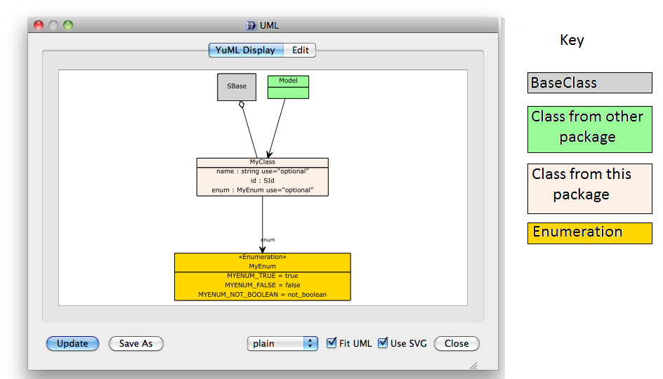
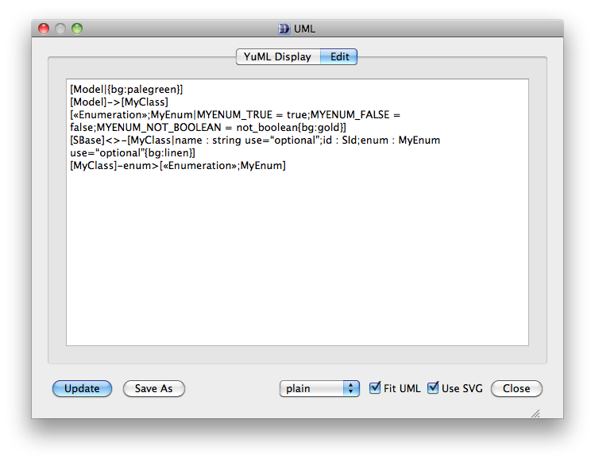
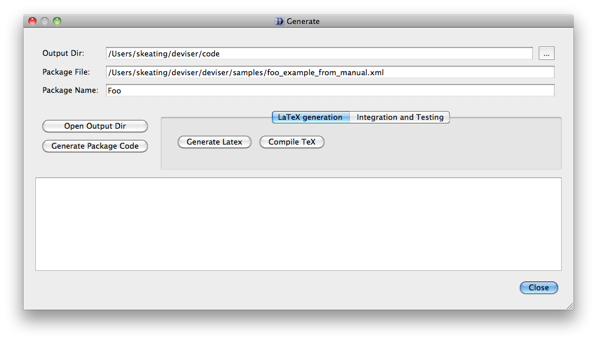
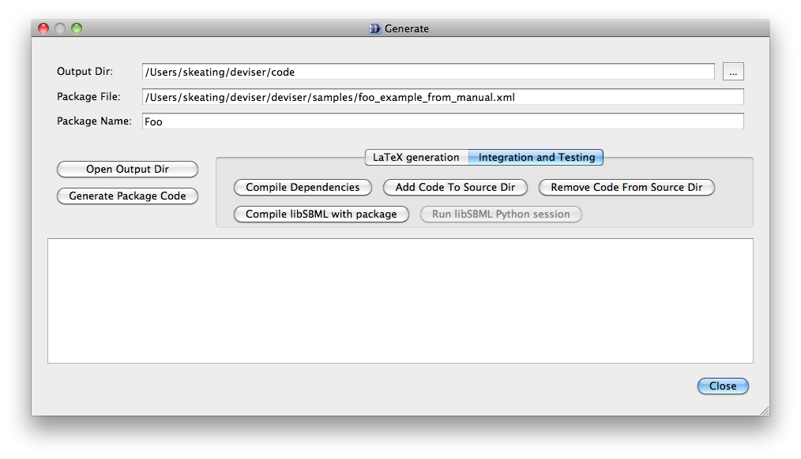
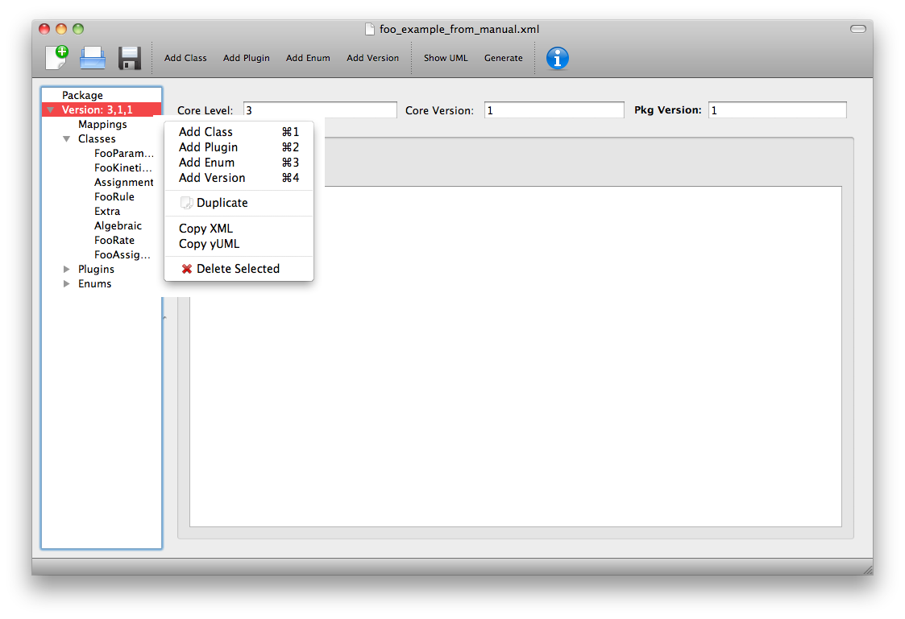

.. _using:

Using Deviser
=============

The Deviser Edit tool allows you to specify the details of an SBML L3
Package. In addition it can be used to perform a number of tasks
directly. Some of these require additional software on your system and
Deviser Edit needs to be given the information about where to find
these. This is described in Section :ref:`setup`.

View UML diagrams.
------------------

Once you have specified at least one class you can click on the **Show
UML** button on the toolbar or select **Show UML** from the Tool menu.
Remember that this uses the yUML webservice and so will only work if you
have an internet connection.

The UML output will appear (:numref:`fig-yuml`). Note that each time this option
is selected a new diagram is generated from the definition; the more
complex the definition the longer it will take.

.. _fig-yuml:

     The UML window

You will note that not all inheritance is determined. Deviser does not
try to infer inheritance of classes from outside this package
definition. However these can be added using the **Edit** window (:numref:`fig-yuml-edit`).

.. _fig-yuml-edit:

     The yUML text representation of the diagram

The **Edit** tab allows access to the text format of the diagram which
can be edited and updated. Note the update applies to the UML diagram
only, not the defined package.

The **Update** button will update the diagram in line with any changes
that have been made to the text description on the Edit panel.

The **SaveAs** button allows the user to navigate to a location of their
choice and save the diagram in a graphic format. PNG, JPG, PDF, SVG and
yUML are all supported.

There is a selection box and two check boxes that allow the user to
change the format of the diagram. These are left for the user to
experiment with.

Generate package code/documentation
-------------------------------------

Click on the **Generate** button on the toolbar and the Generate window
(:numref:`fig-generate`) will appear. Prior to displaying the window 
the validation checks (see :numref:`validate`) are run and any problems reported 
to the user.

.. _fig-generate:

     The Generate window

The **Output Dir**, **Package File** and **Package Name** fields are all 
automatically populated using the information provided. It is recommended 
that you have saved to a file before attempting generation.

The **Generate Package Code** button will then create the package code
and put it in a directory named ‘foo’ (i.e. the name of the package) in
the specified output directory. This code can then be archived and
expanded over the libSBML source tree.

The **Open Output Dir** button provides a shortcut to the output directory 
specified.

Further options are available via the **LaTeX Generation** and 
**Integration and Testing** tabs. Functionality provided here will require
access to further software as detailed in the :ref:`prereq` section.

Generate basic specification documentation.
~~~~~~~~~~~~~~~~~~~~~~~~~~~~~~~~~~~~~~~~~~~

In the Generate window there is a **LaTeX Generation** tab with three
further buttons (:numref:`fig-generate`).

The **Generate LaTeX** button
******************************

The **Generate LaTeX** button will generate three TeX files.

-  body.tex describing each class and its attributes with their types
   and cardinalities.

-  apdx-validation.tex listing the validation rules.

-  macros.tex listing the classes and creating commands for
   cross-referencing

These will be located in a directory named 'foo-spec' within the specified
output directory.

The **Generate LaTeX with Figures** button
********************************************

The **Generate LaTeX with Figures** button will call the yUML services to 
generate figures for each of the classes and plugins specified within the
package description. It also creates an overall diagram of the whole package. 
These are placed in a subdirectory figures within the 'foo-spec' directory.

The three TeX files are then generated

-  body.tex describing each class and its attributes with their types
   and cardinalities and including the UML diagrams for each object.

-  apdx-validation.tex listing the validation rules.

-  macros.tex listing the classes and creating commands for
   cross-referencing

These will be located in a directory named 'foo-spec' within the specified
output directory.

The **Compile TeX** button
***************************

The **Compile TeX** button takes the generated TeX files, creates
another main.tex based on the sbmlpkgspec requirements and generates a
basic specification document as a pdf. This will be located within the 
'foo-spec' directory.

Integrate and test the package with libSBML.
~~~~~~~~~~~~~~~~~~~~~~~~~~~~~~~~~~~~~~~~~~~~

Click the **Integration and Testing** tab in the Generate window and a
further set of buttons are revealed (:numref:`fig-integrate`).

.. _fig-integrate:

   Integration and Testing tab selected on the Generate window.

The **Compile Dependencies** button
************************************
**Compile Dependencies** compiles the dependencies with the specified
C++ compiler to ensure that these are compatible with the libSBML build.
Note that particularly on Windows OS it is necessary for the
libSBML dependencies to be built with the same compiler as that to be
used to build libSBML. If the user has specified the location of the source 
code for the dependencies and the C++ compiler (see :numref:`settings`) then 
this button will invoke a build of the dependencies.

The **Add Code to Source Dir** button
**************************************
**Add Code to Source Dir** places the code generated for package foo
within the libSBML source tree. Note that this merely takes the output 
from the code generation step and places a copy of it within the source tree. 
Thus two copies of the code now exist. One in the Deviser **Output Dir** and one 
embedded within the specified libSBML source tree.  If the 
code is changed, either in the tree or by regenerating using Deviser, then
the other 'copy' is NOT affected. 

This does mean that using this button more than once will overwrite files.
Care need to be taken if code needs to be manually adjusted.

The **Remove Code to Source Dir** button
*****************************************
**Remove Code from Source Dir** removes the code generated for package
foo from the libSBML source tree. The removed code is merely deleted and not
saved elsewhere. Thus any changes made to the code within the tree will be lost.

The **Compile libSBML with package** button
********************************************
**Compile libSBML with package** enables package foo within the libSBML
build and runs the build.

.. todo::
    List the configuration options used by this build

Utility functions in Deviser Edit
----------------------------------

There are a number of functions to facilitate use of Deviser Edit and reporting
of issues. Using the tree view on the left right clicking on an object reveals 
a menu as shown in :numref:`deviser-util`.

.. _deviser-util:

   Utility menu.

The **Add XYZ** items
~~~~~~~~~~~~~~~~~~~~~~~
The various **Add** items will add the appropriate object to the Version selected.
This will work from any object within the tree. So in :numref:`deviser-util` 
highlighting *FooRate* and selecting *Add Enum* would add a new Enum to the list for
Version 3,1,1.

The **Duplicate** item
~~~~~~~~~~~~~~~~~~~~~~~

The **Duplicate** item creates a copy of the selected item (where this makes sense).
So it is possible to duplicate individual classes, plugins or enums but the headers
*Mappings*, *Classes*, *Plugins* and *Enums* cannot be duplicated.
It is also possible to duplicate the entire version, which creates a new version
with identical elements as the one being copied. Section :ref:`mult-vers` gives more details.

In :numref:`deviser-util` 
highlighting *FooRate* and selecting *Duplicate* would add a new class to the list for
Version 3,1,1. This class would be identical to *FooRate* except it would have the name 
*FooRate_copy*. 

The **Copy XML** item
~~~~~~~~~~~~~~~~~~~~~

The **Copy XML** item copies the Deviser XML description of the selected object 
to the clipboard; thus making it available for pasting elsewhere.
Similarly to **Duplicate** this works for individual classes, plugins, enums 
and versions but not for the other headers.

.. _xml-model:

   Example of text copied when highlighting *Model* from the *Plugins* and selecting *Copy XML*

.. code-block:: XML

      <?xml version="1.0" encoding="UTF-8"?>
      <plugin extensionPoint="Model">
        <attributes>
          <attribute name="useFoo" required="true" type="boolean" abstract="false"/>
        </attributes>
      </plugin>

The **Copy yUML** item
~~~~~~~~~~~~~~~~~~~~~~~

The **Copy yUML** item copies the yUML text description of the selected object 
to the clipboard; thus making it available for pasting elsewhere.
Similarly to **Duplicate** this works for individual classes, plugins, enums 
and versions but not for the other headers.

.. _yuml-sign:

   Example of text copied when highlighting *Sign* from the *Enums* and selecting *Copy yUML*

.. code-block:: XML

      [«Enumeration»;Sign|SIGN_FOO_POSITIVE = positive;SIGN_FOO_NEGATIVE = negative;SIGN_FOO_NEUTRAL = neutral{bg:gold}]

The **Delete Selected** item
~~~~~~~~~~~~~~~~~~~~~~~~~~~~~

The **Delete Selected** item removes the item from the description.
Similarly to **Duplicate** this works for individual classes, plugins, enums 
and versions but not for the other headers.

Command line
------------

The command line function deviser.py can be invoked directly.

deviser.py [--generate][--latex] input-file.xml

This program takes as input a Deviser XML file and either

-  --generate (-g) generates the libSBML code for the package

    This generates the complete src package that can be zipped and then
    unzipped over an existing libSBML src tree.

-  --latex (-l) generates a LaTeX scaffold for its specification.

    This generates the adx-validation.tex, macros.tex and body.tex files
    which can then be integrated into a package pdf using the
    sbmlpkgspec files.

Generation of a pdf or integration with libSBML can then be done
manually.

